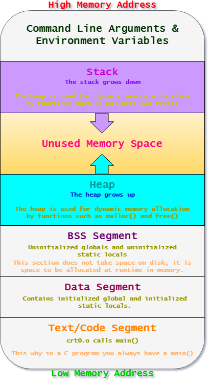

My plan is when I find sometime...(bear with me, time is a precious resource =) ) I would like to update this post or make a series with detailed program information and execution walk through as it would relate to reverse engineers, security engineers, and even students. I would like to fill the gap of posts and other information I read, as I always feel like there is need to fill in the cracks.

To start this post(s) here is the layout of an executable in memory . Feel free to contact me with suggestions/recommendations!

