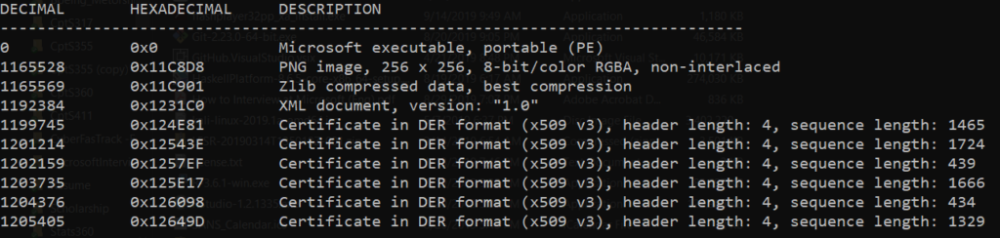

In this blog I will walk you through how to extract data from files. I work with both Windows and Linux on a regular basis and I have found the Windows Subsystem for Linux to be a godsend. It has allowed me to streamline my workflow and not use a virtual machine as much, which saves me a lot of time and allows me to be much more efficient when doing things like performing analysis on files.

So to start with, I recommend you download dev VM from Microsoft and you install the Windows Subsystem for Linux. For information as to how to install WSL go [here](https://docs.microsoft.com/en-us/windows/wsl/install-win10). Alternatively you can use another virtual machine with Linux, but then you will have to transfer files back and forth. Also some of the tools that I will be using may not be installed in the distro you might be using, in which case you can do a quick Goolge search on how to install the tool. After all knowing how to do some research is part of being a hacker, and I have faith in you that you can do it! Alright, well let's jump right. =).

For this exercise we are going to use the beloved Flash player from Adobe, you can get your very own copy @ [https://get.adobe.com/flashplayer/](https://get.adobe.com/flashplayer/) .

Our scenario is that we found a funny file on a Windows machine, that is we don't know it's source, we don't know if it's malicious or not, but we need to triage and get some information out of the file.

One of the first things I do is check the hash of the file, since we are in Windows already let's start there with some PowerShell. Run the command:

`Get-FileHash .\flashplayer32pp_xa_install.exe`

My has output hash for the one I downloaded was :  
DA7642EF2C8C4BCD60D99513B541CDBC2336409BCD1659B6CA1BF770C58A512F

A hash is sorta like a one way encryption, it performs a calculation on the file and outputs the hash. The hash "should" be unique to a file, thus verifying it's integrity. I say should because there has been collisions found with SHA1 (read more about it [here](https://www.theverge.com/2017/2/23/14712118/google-sha1-collision-broken-web-encryption-shattered)), but SHA2 is considered to be the standard at this time and should be good to go, at least for the time being.

With a lot of files now days you can verify the hash to make sure the file has not be tampered with, usually this will be provided where you download the file or somewhere on the website of the developer company. In our case I could not find one from Adobe (If you do know where, ping me and I will add revise this).

Our next move is to check if this hash is known, or has been seen in the wild. This next step may also give us clues on the source of the file if it has been seen before. Enter our friend VirusTotal. Go to VirusTotal.com, click the "SEARCH" tab and enter the hash. To make things quicker you could click my search:  
[https://www.virustotal.com/gui/file/da7642ef2c8c4bcd60d99513b541cdbc2336409bcd1659b6ca1bf770c58a512f/detection](https://www.virustotal.com/gui/file/da7642ef2c8c4bcd60d99513b541cdbc2336409bcd1659b6ca1bf770c58a512f/detection)

VirusTotal runs the hash against is database and returns the results if it has data about the file. What VirusTotal does, is give a file that is uploaded it runs it against a bunch of different antivirus and detection vendors to see if they find anything wrong with the file or have seen it before. Notice that you could have alternatively upload the file, which is how they got this information in the first place, but once you do that you can't take it back and it will be shared with the community. That will also alert the "bad guys" if it was malware, because they check this as well to see if they have been spotted. So in short you need to beware of what is happening when you are using a tool or a service, and that goes for any tool!

Now let's look at the details and it gives us all kinds of info I can revisit this section later but for now let's move on and let's say we didn't find the hash in VT and we don't want to upload it, at least not yet.

Let's try the following two cmdlets below:

`(Get-AuthenticodeSignature .\flashplayer32pp_xa_install.exe).SignerCertificate.Subject`

The output:  
CN=Adobe Inc., OU=Flash Player, O=Adobe Inc., L=San Jose, S=ca, C=US, SERIALNUMBER=2748129, OID.2.5.4.15=Private Organization, OID.1.3.6.1.4.1.311.60.2.1.2=Delaware, OID.1.3.6.1.4.1.311.60.2.1.3=US

`(Get-AuthenticodeSignature .\flashplayer32pp_xa_install.exe).SignerCertificate.IssuerName`

CN=DigiCert EV Code Signing CA (SHA2), OU=www.digicert.com, O=DigiCert Inc, C=US System.Security.Cryptography.Oid {48, 108, 49, 11…}

Alright so it looks like the file has been digitally signed by Adobe Inc and DigiCert verified that Adobe Inc indeed owns the cert or private key used to sign this binary.

Next we are going to once again pretend we did not get much out of the operation above, and we might need to dig further.

Let's start a instance of WSL/Bash in that directory. let's run:

`file flashplayer32pp_xa_install.exe`

The output:  
flashplayer32pp\_xa\_install.exe: PE32 executable (GUI) Intel 80386, for MS Windows, PECompact2 compressed

Hmm...ok that is interesting so it is a PE32 (32 bit) Windows executable and it looks like it's GUI based. The program file picks this stuff up from the file header, read more about file headers [here](https://en.wikipedia.org/wiki/File_format#File_header) and a nice list of signatures [here](https://en.wikipedia.org/wiki/List_of_file_signatures). Also, notice it says it is compressed... well that interesting let's see if we can dig further...

We are going to use another of my favorite tool called binwalk. Binwalk is a very powerful tool usually used in extracting and reversing firmware, but we will not get too deep into that part, as this is not a reversing post. But the cool thing that binwalk does, is that it digs further into the file to see if it can find any other stuff that might be embedded within...like other file headers meaning may be other files? Run:

`binwalk flashplayer32pp_xa_install.exe`

Output:  

0 0x0 Microsoft executable, portable (PE)  
1165528 0x11C8D8 PNG image, 256 x 256, 8-bit/color RGBA, non-interlaced  
1165569 0x11C901 Zlib compressed data, best compression  
1192384 0x1231C0 XML document, version: "1.0"  
1199745 0x124E81 Certificate in DER format (x509 v3), header length: 4, sequence length: 1465  
1201214 0x12543E Certificate in DER format (x509 v3), header length: 4, sequence length: 1724  
1202159 0x1257EF Certificate in DER format (x509 v3), header length: 4, sequence length: 439  
1203735 0x125E17 Certificate in DER format (x509 v3), header length: 4, sequence length: 1666  
1204376 0x126098 Certificate in DER format (x509 v3), header length: 4, sequence length: 434  
1205405 0x12649D Certificate in DER format (x509 v3), header length: 4, sequence length: 1329

Alright, so it found more stuff! Alright I will leave this one here for now and I will either edit this or continue in Part. Please let me know if you have any feedback or suggestions and what else you would like to see. Best way is probably twitter `@ManuelBerrueta`
