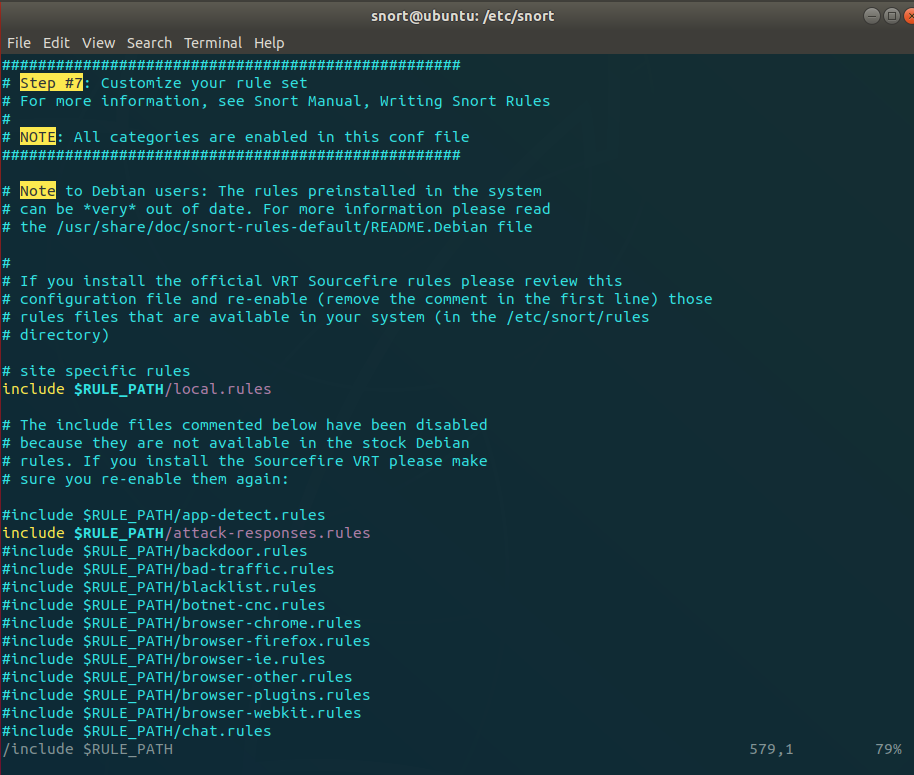
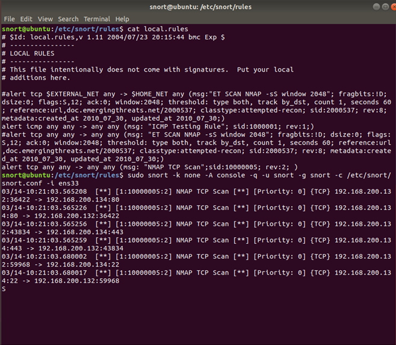
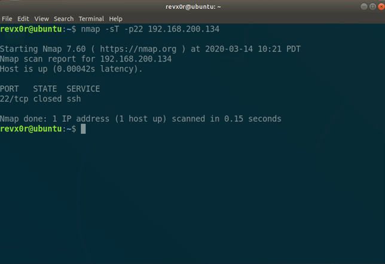

## What is Snort?

Snort is an open source Intrusion Prevention System aka IPS and a Intrusion Detection System aka IDS actively maintained by Cisco Talos. This means that it can help you detect potential interesting traffic in your network that may indicate an intrusion attempt is taking place or later after the fact that one has taken place and you may have a potential unwanted guest in your system. It also has the potential to nullify bad traffic from your network by detecting an exploit and dropping the traffic before it is successful. In short, it is a good tool that has been around for a while that you can leverage as part of your defense tool set. I encourage to check out snort.org to find out more about it from them as well!

This is meant to be a very brief intro to how to use Snort and I will link to other resources that I used in my journey to using Snort. I am not trying to reinvent the wheel, just trying to share some of my experience using the tool which hopefully will help you get started and understand it a little better.

## Install Snort

There is a few different ways to do it, you can go to the Snort.org website to guide you through it or you can do what I did and use the package manager in your distro. I personally like to use Ubuntu for demos and most of my VM work, so it is a simple "apt install snort".

To run Snort: sudo snort -k none -A console -q -u snort -g snort -c /etc/snort/snort.conf -i <interface>  
Replace <interface> with your interface you would like to monitor. In a VM ens33 is pretty standard. If you are running bare metal wlan0 and eth0 are pretty standard as well. If you don't know what interface you want to hook into you can run one of the following commands "ifconfig" or "ip a" which will list your IP and interfaces available.

When I am testing new rules I disable all the other rules except for local.rules from the snort.conf file. You can use favorite text editor and you will probably need to run it as sudo, i.e. "sudo vim /etc/snort/snort.conf". Find the area where the "include $RULE\_PATH/" starts. If you are using vim you can use the '/' and type it in, you can press 'n' to move to the next location where that given string is found as well. I recommend you backup for configuration file that way you can go back to it when you are done testing easily by just overwriting the current one, to back it up you can simply make a copy of it by doing cp snort.conf snort.conf.bkup. Note that you could also keep a copy of your newly modified commented out rules for next time you want to test by making a copy it as well.

In this image you can see the section I am talking about. All you have to do is put a '#' in front of each include and that will disable that rule set.

Each one of those \*.rules is actually a set or collection of rules. They are usually located in the /etc/snort/rules directory.

Once the rules are disabled, you can go to your /etc/snort/rules/local.rules file and start adding your new rule you want to test.

For this demo I used the following rule: alert tcp any any -> any any (msg: "NMAP TCP Scan";sid:10000005; rev:2; )  
Which is one of the rules found here: [https://www.hackingarticles.in/detect-nmap-scan-using-snort/](https://www.hackingarticles.in/detect-nmap-scan-using-snort/)  
To understand the rules a little better you can follow this link: [https://blog.rapid7.com/2016/12/09/understanding-and-configuring-snort-rules/](https://blog.rapid7.com/2016/12/09/understanding-and-configuring-snort-rules/)  
And also check out the snort.org website.

And here are the screenshots:

One thing to note is that this things need tuning and they can be rather noisy, so it can take time to develop the rules that work best for your network. Also it doesn't do much help if you are not monitoring its output!

You could also set this up on Raspberry Pi in your network to start looking at your traffic. Happy Hunting!
