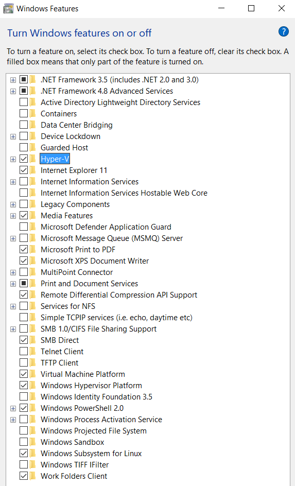
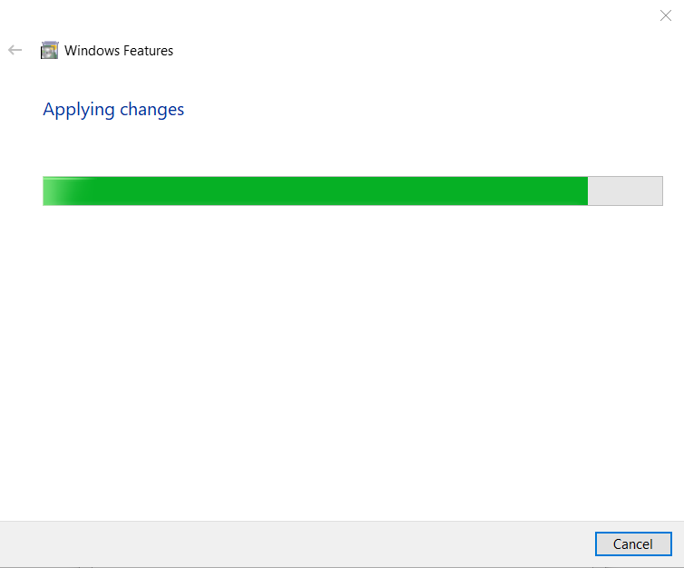
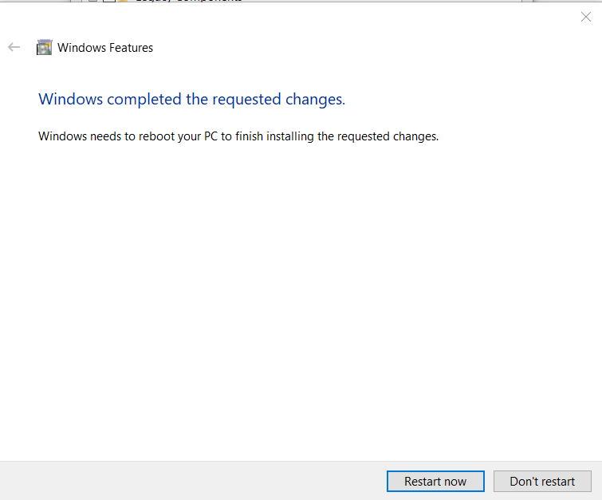
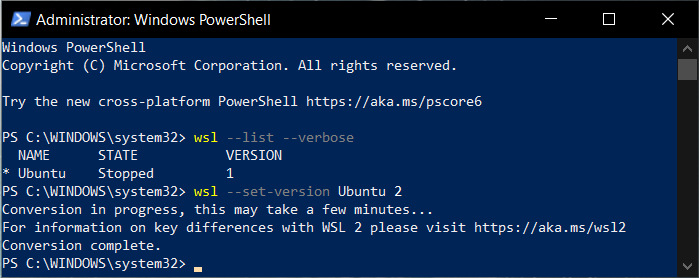

I have been using the Windows Subsystem for Linux (WSL) for a while now. I have used it before for doing some local development, things can get a little dicey if you are doing lower level dev, but overall it worked pretty good.

Prior to WSL I would just fire up a VM usually a Ubuntu or Kali VM depending on what I was going to do, but after WSL came out I could put a lot of the tools I used to use in there and just stay on Windows and keep chugging along. But... there was some limitations to WSL such as the raw socket support. If you wanted to run NMAP, that was not a thing that was supported. WSL was also somewhat slow, and it did not have a full Linux Kernel.

But no need to be worried! Here comes WSL 2 to the rescue. WSL 2 uses an actual Linux kernel and virtualization via Hyper-V to provide major improvements, like doing those NMAP scans I was talking about as well as improved speed, the speed improvements are pretty impressive.

Now there is some caveats to doing this upgrade...I have already mentioned it uses Hyper-V. This may be a deterrent to some, and something I want to make you aware about before we go any further with an upgrade. I use VMware Workstation Pro for doing development, reverse engineering and other security stuff. Lucky for me, VMware has been working with Microsoft in to building a version of it that is compatible with Hyper-V, thus I can still use my other VMs. I will link to that for your upgrade. I know a lot of people use VirtualBox, I use it on occasion but I find VMware to work a lot better for me. I mention this because you may want to do some research if VirtualBox is your hypervisor of choice since I do not know if they are working on making a compatible version of it. Alright let's get to it!

First, if you don't have WSL installed yet, you need to set this up by typing "Turn Windows features on or off" in your start menu. Then select "Windows Subsystem for Linux". If you don't have Hyper-V installed yet, you do it from this same menu as well, so select Hyper-V here too. Click OK!



Then you will get the next 2 screens:



<figure>



<figcaption>

Go ahead and click Restart now  


</figcaption>

</figure>

Alright now let's upgrade to WSL2! Run the following command from PowerShell:

```
dism.exe /online /enable-feature /featurename:VirtualMachinePlatform /all /norestart
```

Now restart your machine.  
After the restart open up PowerShell once again to set the default version of WSL to version 2 with the following command:

```
wsl --set-default-version 2
```

Now we need the Linux kernel update package, download it at [https://aka.ms/wsl2kernel](https://aka.ms/wsl2kernel).

Install this package, mine was "wsl\_update\_x64.msi". Once this is done, if you don't already have a WSL version installed, got to the Microsoft store and choose the flavor you want, I personally use Ubuntu for my WSL.

Now if you already have a current version of WSL 1, you need to upgrade the current version to WSL 2. First we need to find what WSL we have installed by running the following command:

```
wsl --list --verbose
```

In my case is just Ubuntu, so I run the next command to upgrade it:

```
wsl --set-version Ubuntu 2
```

Here is a screenshot of what that looks like:



What it says about taking a few minutes is not a joke, be patient and let it do it's work and you will be rewarded! After it is done, now you can take advantage of it's new features, including doing that NMAP scan I was talking about =)

Somethings to keep in mind:  
\- Keeping your development/project files within the Linux file system will perform better  
\- You can use Windows tool such as explorer. For explorer just type "explorer.exe .", this will open up the Windows File Explorer in the current WSL directory

Let's now take care of VMware Workstation. First go to this page and scroll down to the "Quick download links:" and under the "Workstation Pro for Windows" select Direct Download. Now run the file "VMware-workstation-full-e.x.p-16227267.exe" and follow the direction to download the 20H2 update. Then restart your machine.

Now one last thing you may want to do if you already have VMs, is upgrade them to the beta version. But I was able to run them without upgrading.

Good luck and have fun!

References:  
[https://docs.microsoft.com/en-us/windows/wsl/install-win10](https://docs.microsoft.com/en-us/windows/wsl/install-win10)  
[https://docs.microsoft.com/en-us/windows/wsl/compare-versions](https://docs.microsoft.com/en-us/windows/wsl/compare-versions)  
[https://blogs.vmware.com/workstation/2020/05/directx-11-now-with-workstation-tp20h2.html](https://blogs.vmware.com/workstation/2020/05/directx-11-now-with-workstation-tp20h2.html)
