In the Marine Corps, we have a saying "Train like you fight". I like to keep that mindset when I approach anything work related and therefore our approach will be that of a real engagement.  
   
Also, remember to take notes as we go along, this is useful to keep track of what is what, helping you not to overlook things and also to write a report at the end of the engagement of your findings.  
   
Last but not least, I did this walkthrough as I was going through that section of the `Practical Ethical Hacking` course in [TCM Academy](https://academy.tcm-sec.com/)([@TCMSecurity](https://twitter.com/TCMSecurity)). Great course at an affordable price and in an easy to consume format, highly recommend it!

# Scope & Initial Planning

Scope is a very important piece of our puzzle when we are doing an assessment. We need to understand what is important to the client/customer, what piece of data and information could be devastating to the business if an attacker got a hold of it. For our purposes, our scope will be anything involved with the Kioptrix box. That means any open ports/services are fair game.

# Recon - Information Gathering

`Kioptrix` is a vulnerable Red Hat Virtual Machine from [VulnHub](https://www.vulnhub.com/) in which our goal is to gain root level access to the machine. It will work in both VMware Workstation and VirtualBox.  
  We must first find the machine, let's start by seeing what is on our network:

```
# Lets find our IP Address using the ip command
ip a
# We can also find our IP with ifconfig
ifconfig

# Now we use the first 3 octects to search
netdiscover -r 10.0.0.0/24

# Note that you may need to adjust your IP based on the output to something like 192.168.x, which is a lot more common for local private networks.
```

I am using VMware Workstation, so in my case I am looking for a VMware Mac address in the output:

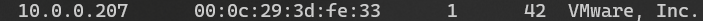

Bingo! We found it!

# Scanning & Enumeration

Alright, now that we have an IP address, let's do some scanning on our target host:

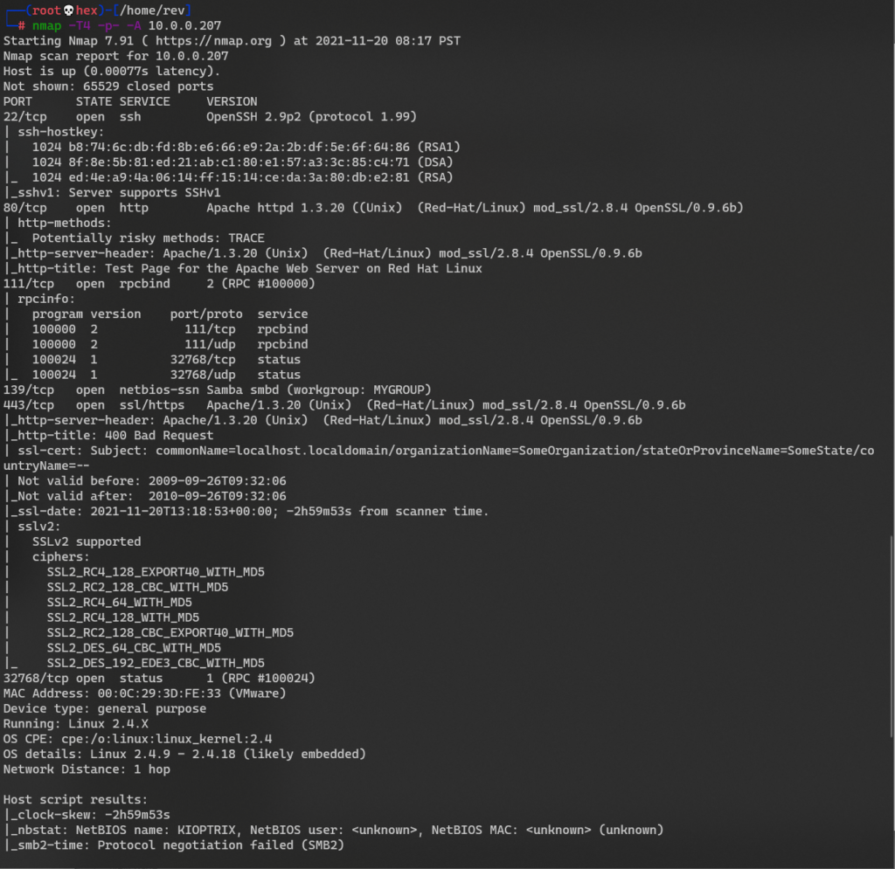

One thing I do like to do when I do these scans is to save the output so I can use it later. If you are scripting, the `-oX` option outputs as XML, which you can then use to parse the output: `nmap -T4 -p- -A 10.0.0.207 -oX output.xml`    
Another thing you could do in the sake of saving some time, is to first scan for all ports and then only probe the ports that came back open with the `-A` option:

```
# Scan All Ports:
nmap -T4 -p- 10.0.0.207

# Scan with -A ONLY for the ports found to be open:
nmap -T4 -p 22,80,111,139,443,32768 -A 10.0.0.207
```

Let's take a look at the output of our scan and focus on interesting ports and services...

- `SSH` running on port `22`, which will allow us to connect remotely if or when we have some some creds. -- It is running OpenSSH version 2.9p2
- `HTTP` @ port `80`. That means we have a website running from that machine. We'll have to visit that and take a look! -- We also have additional information that the webserver is running `Apache 1.3.20`
- `netbios-ssn` on port `139`. We can think `SMB` and that it will more than likely be very much worth our while looking into shares.

We should start with the lowest hanging fruit first, let's take a look at the webpage.

### Web Server / Page / App Enumeration

Let's start by visiting the page:

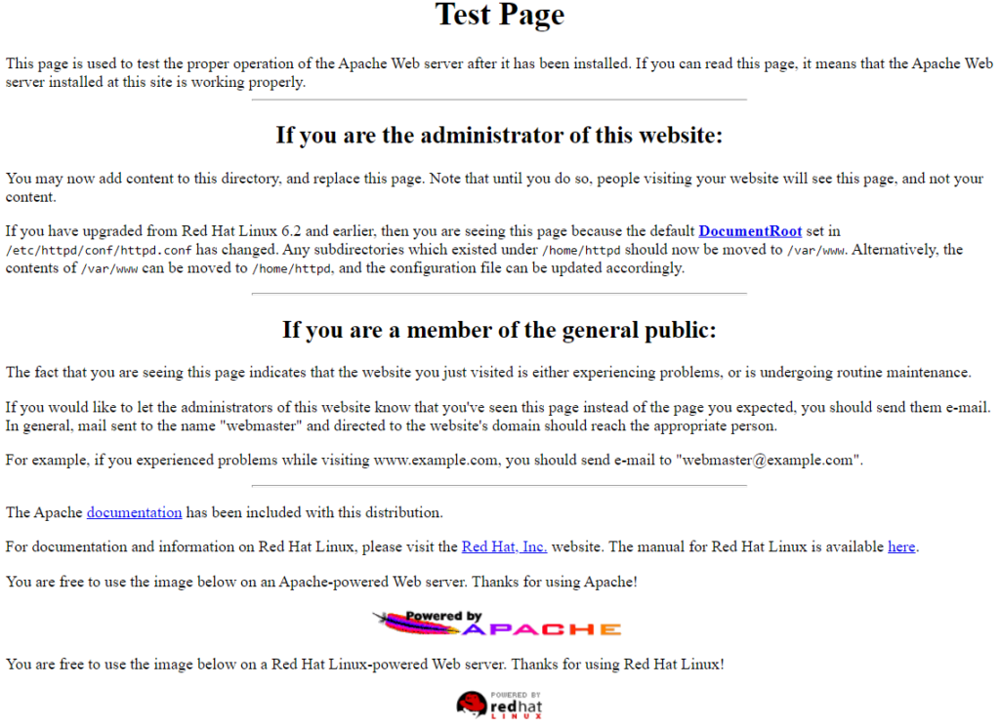

The page looks like the default Apache Test Page.

We can leverage Wappalyzer (a browser extension) to get some quick additional info from the page:

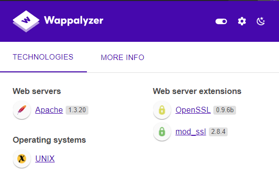

It verifies what `Nmap` had shared with us about `Apache 1.3.20`, `mod_ssl 2.8.4`, and `OpenSSL 0.9.6b`.

For our next step we can use `Nikto`, a web server scanner. Depending on the security of the website we may find the results to be useful or may be not.... For example, if the server is running a WAF (Web Application Firewall), the WAF may attempt to drop/block the traffic and therefore we may not get anything useful out of our scan.  
   
In our case we get some good results:

```
└─$ nikto -h 192.168.153.128                                   1 ⨯
- Nikto v2.1.6
---------------------------------------------------------------------------
+ Target IP:          192.168.153.128
+ Target Hostname:    192.168.153.128
+ Target Port:        80
+ Start Time:         2021-11-28 09:12:50 (GMT-8)
---------------------------------------------------------------------------
+ Server: Apache/1.3.20 (Unix)  (Red-Hat/Linux) mod_ssl/2.8.4 OpenSSL/0.9.6b
+ Server may leak inodes via ETags, header found with file /, inode: 34821, size: 2890, mtime: Wed Sep  5 20:12:46 2001
+ The anti-clickjacking X-Frame-Options header is not present.
+ The X-XSS-Protection header is not defined. This header can hint to the user agent to protect against some forms of XSS
+ The X-Content-Type-Options header is not set. This could allow the user agent to render the content of the site in a different fashion to the MIME type
+ OpenSSL/0.9.6b appears to be outdated (current is at least 1.1.1). OpenSSL 1.0.0o and 0.9.8zc are also current.
+ mod_ssl/2.8.4 appears to be outdated (current is at least 2.8.31) (may depend on server version)
+ Apache/1.3.20 appears to be outdated (current is at least Apache/2.4.37). Apache 2.2.34 is the EOL for the 2.x branch.
+ OSVDB-27487: Apache is vulnerable to XSS via the Expect header
+ Allowed HTTP Methods: GET, HEAD, OPTIONS, TRACE 
+ OSVDB-877: HTTP TRACE method is active, suggesting the host is vulnerable to XST
+ OSVDB-838: Apache/1.3.20 - Apache 1.x up 1.2.34 are vulnerable to a remote DoS and possible code execution. CAN-2002-0392.
+ OSVDB-4552: Apache/1.3.20 - Apache 1.3 below 1.3.27 are vulnerable to a local buffer overflow which allows attackers to kill any process on the system. CAN-2002-0839.
+ OSVDB-2733: Apache/1.3.20 - Apache 1.3 below 1.3.29 are vulnerable to overflows in mod_rewrite and mod_cgi. CAN-2003-0542.
+ mod_ssl/2.8.4 - mod_ssl 2.8.7 and lower are vulnerable to a remote buffer overflow which may allow a remote shell. http://cve.mitre.org/cgi-bin/cvename.cgi?name=CVE-2002-0082, OSVDB-756.
+ ///etc/hosts: The server install allows reading of any system file by adding an extra '/' to the URL.
+ OSVDB-682: /usage/: Webalizer may be installed. Versions lower than 2.01-09 vulnerable to Cross Site Scripting (XSS).
+ OSVDB-3268: /manual/: Directory indexing found.
+ OSVDB-3092: /manual/: Web server manual found.
+ OSVDB-3268: /icons/: Directory indexing found.
+ OSVDB-3233: /icons/README: Apache default file found.
+ OSVDB-3092: /test.php: This might be interesting...
+ /wp-content/themes/twentyeleven/images/headers/server.php?filesrc=/etc/hosts: A PHP backdoor file manager was found.
+ /wordpresswp-content/themes/twentyeleven/images/headers/server.php?filesrc=/etc/hosts: A PHP backdoor file manager was found.
+ /wp-includes/Requests/Utility/content-post.php?filesrc=/etc/hosts: A PHP backdoor file manager was found.
+ /wordpresswp-includes/Requests/Utility/content-post.php?filesrc=/etc/hosts: A PHP backdoor file manager was found.
+ /wp-includes/js/tinymce/themes/modern/Meuhy.php?filesrc=/etc/hosts: A PHP backdoor file manager was found.
+ /wordpresswp-includes/js/tinymce/themes/modern/Meuhy.php?filesrc=/etc/hosts: A PHP backdoor file manager was found.
+ /assets/mobirise/css/meta.php?filesrc=: A PHP backdoor file manager was found.
+ /login.cgi?cli=aa%20aa%27cat%20/etc/hosts: Some D-Link router remote command execution.
```

There are some interesting findings in the `nikto` output:

- It found the host might be vulnerable to Cross-Site Tracing (XST) leveraging the `TRACE` verb which can allow an attacker to steal user's cookies or present them with a malicious website using Cross-Site Scripting (XSS) where XSS is code injection from the client side of the website.
    - **Reference**: [https://owasp.org/www-community/attacks/Cross\_Site\_Tracing](https://owasp.org/www-community/attacks/Cross_Site_Tracing)
- Apache 1.3.20 - Possible DoS and code execution.
- Apache 1.3.20 - Overflows which could be leveraged with an exploit.
- mod\_ssl 2.8.4 - Vulnerable to remote buffer overflow, this one is particularly interesting :)
- Webalizer may be installed. Versions lower than 2.01-09 vulnerable to Cross Site Scripting (XSS)
- backdoor file manager may also be of interest!

#### Web Directory Enumeration

There are quite a few popular tools we can leverage to enumerate web directories/URLs. I will be using dirbuster. Here we just input the IP address as `http://192.168.153.128:80/` and give dirbuster a word list. If you are using Kalie you can find the wordlists in `/usr/share/wordlists/`, specifically for `dirbuster` we can find them in `/usr/share/wordlists/dirbuster/` and for this one I will be using the small word list:

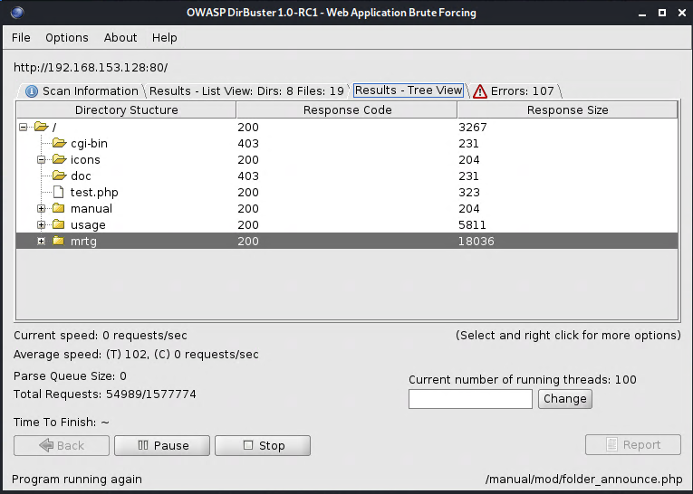

From here we could go over the pages and see if we find anything interesting. From a quick look, nothing juicy caught my eye so I will continue along and see what else we can find...

### SMB Enumeration

With our initial Nmap scan we found SMB open on port 139. Let's dig further into this as we can often exploit SMB and abuse the access to shares.

We'll start by leveraging some of the scripts included in Nmap to get more information:

```
└─$ nmap -p 139 --script nbstat.nse 192.168.153.128
Starting Nmap 7.91 ( https://nmap.org ) at 2021-11-29 09:09 PST
Nmap scan report for 192.168.153.128
Host is up (0.0011s latency).

PORT    STATE SERVICE
139/tcp open  netbios-ssn

Host script results:
| nbstat: NetBIOS name: KIOPTRIX, NetBIOS user: <unknown>, NetBIOS MAC: <unknown> (unknown)
| Names:
|   KIOPTRIX<00>         Flags: <unique><active>
|   KIOPTRIX<03>         Flags: <unique><active>
|   KIOPTRIX<20>         Flags: <unique><active>
|   \x01\x02__MSBROWSE__\x02<01>  Flags: <group><active>
|   MYGROUP<00>          Flags: <group><active>
|   MYGROUP<1d>          Flags: <unique><active>
|_  MYGROUP<1e>          Flags: <group><active>

Nmap done: 1 IP address (1 host up) scanned in 1.38 seconds
```

Let's try using Metasploit as well to enumerate further. Run `msfconsole`, then `use auxiliary/scanner/smb/smb_version`. Here we can type `options` to see what else is required to use this module. We need to specify the RHOSTS, which will be the IP and number of threads to use:

```
msf6 > use auxiliary/scanner/smb/smb_version
msf6 auxiliary(scanner/smb/smb_version) > options

Module options (auxiliary/scanner/smb/smb_version):

   Name     Current Setting  Required  Description
   ---- --------------- -------- -----------
   RHOSTS                    yes       The target host(s), see ht
                                       tps://github.com/rapid7/me
                                       tasploit-framework/wiki/Us
                                       ing-Metasploit
   THREADS  1                yes       The number of concurrent t
                                       hreads (max one per host)

msf6 auxiliary(scanner/smb/smb_version) > set RHOSTS 192.168.153.128
RHOSTS => 192.168.153.128
msf6 auxiliary(scanner/smb/smb_version) > run

[*] 192.168.153.128:139   - SMB Detected (versions:) (preferred dialect:) (signatures:optional)
[*] 192.168.153.128:139   - Host could not be identified: Unix (Samba 2.2.1a)
[*] 192.168.153.128:      - Scanned 1 of 1 hosts (100% complete)
[*] Auxiliary module execution completed
```

Awesome, now we have a version number for Samba which we might be able to use in the future.

Let's do some further enumeration:

```
└─$ smbclient -L \\\\192.168.153.128\\
Server does not support EXTENDED_SECURITY  but 'client use spnego = yes' and 'client ntlmv2 auth = yes' is set
Anonymous login successful
Enter WORKGROUP\rev's password: 

        Sharename       Type      Comment
        --------- ---- -------
        IPC$            IPC       IPC Service (Samba Server)
        ADMIN$          IPC       IPC Service (Samba Server)
Reconnecting with SMB1 for workgroup listing.
Server does not support EXTENDED_SECURITY  but 'client use spnego = yes' and 'client ntlmv2 auth = yes' is set
Anonymous login successful

        Server               Comment
        --------- -------
        KIOPTRIX             Samba Server

        Workgroup            Master
        --------- -------
        MYGROUP              KIOPTRIX
```

**NOTE**: With the latest version of Kali I run into an issue when using smbclient and I had to fix it by editing the samba configuration file and adding the following options under `[global]` using `sudo vim /etc/samba/smb.conf` :

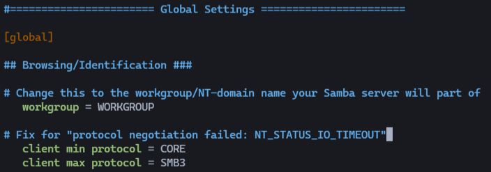

Now that we have some share names we can attempt to connect to the shares and see if we can use them to our advantage:

```
└─$ smbclient \\\\192.168.153.128\\IPC$
Server does not support EXTENDED_SECURITY  but 'client use spnego = yes' and 'client ntlmv2 auth = yes' is set
Anonymous login successful
Enter WORKGROUP\rev's password: 
Try "help" to get a list of possible commands.
smb: \> ls
NT_STATUS_NETWORK_ACCESS_DENIED listing \*

└─$ smbclient \\\\192.168.153.128\\ADMIN$                                                  130 ⨯
Server does not support EXTENDED_SECURITY  but 'client use spnego = yes' and 'client ntlmv2 auth = yes' is set
Anonymous login successful
Enter WORKGROUP\rev's password: 
tree connect failed: NT_STATUS_WRONG_PASSWORD
```

So not too much here, limited accessibility but we surfaced new information for our notes.

### Vulnerability Scanning

Additional to all the work we have done so far, we can do a vulnerability scan of the target(s) with `Nessus` to see if we can find some vulnerabilities we can leverage. The nice thing about Nessus is that it performs a lot of the work automatically for you which scales very nicely:

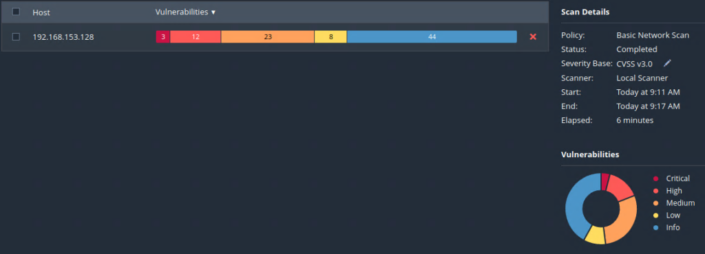

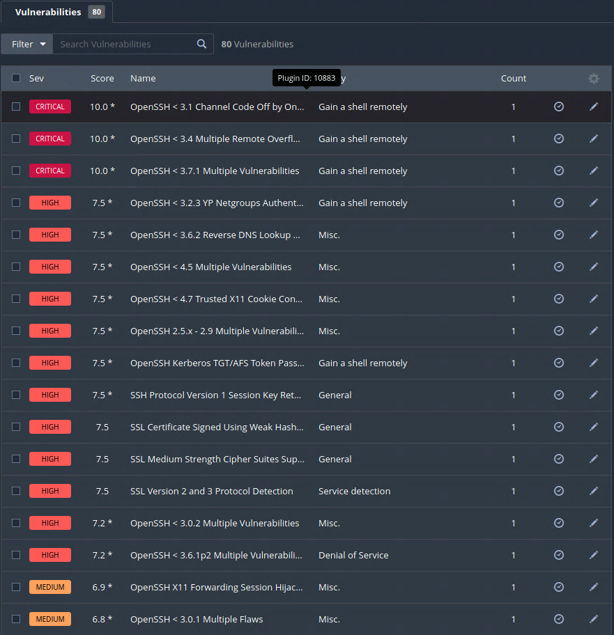

### Recap so far...

Now we have enumerated quite a few things on this machine and thanks to our good note keeping we can investigate further and see if we can leverage anything that we have found so far to accomplish our goals.

### Pre-Exploitation - Google FU

We can try to search for vulnerabilities with the application/ service version numbers:

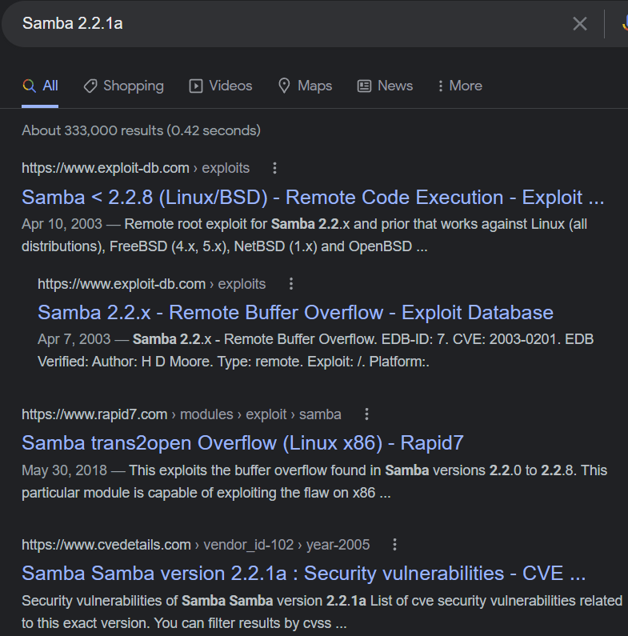

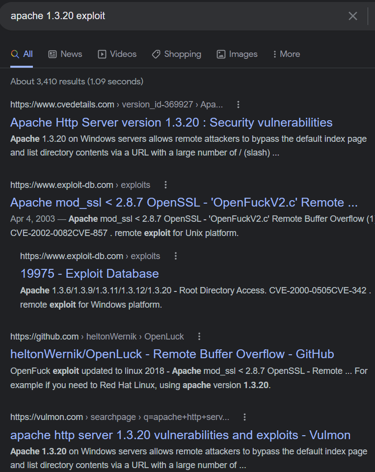

In this section we can see that there are several different ways we can find things out about our target, and the more we know the more successful we will be.

## Pre-Exploitation - Searchsploit

We can use the `searchsploit` tool in Kali to search for possible exploits available for the applications/services that we have enumerated so far as well:

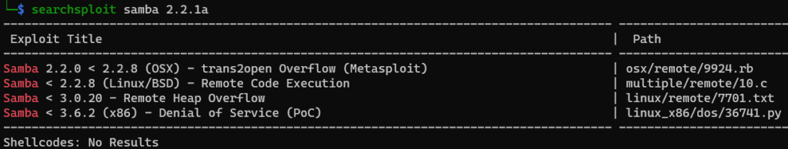

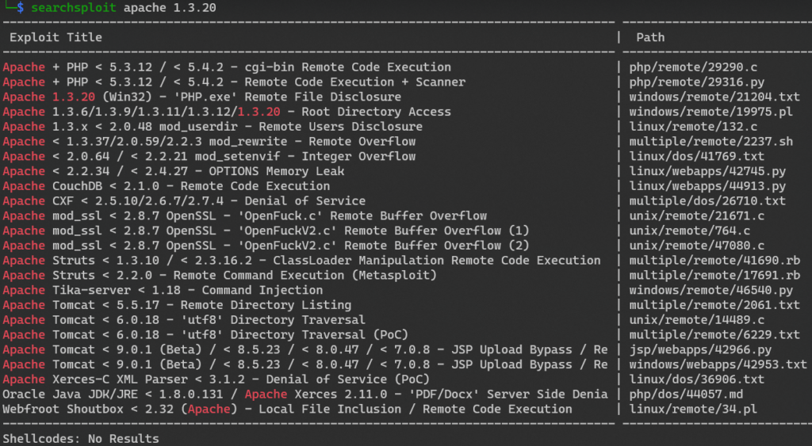

# Exploitation

We are going to be using everything we've gathered so far to find a way into this machine and get a root shell! This is definitely another exciting part of the whole process where everything comes together!

### Exploiting Samba 2.2.1a

We know by using both `searchsploit` and our friend Google that there is a vulnerability in this version of Samba and that there is an exploit for it. Here is a link to the Rapid7 reference [Samba trans2open Overflow](https://www.rapid7.com/db/modules/exploit/linux/samba/trans2open/). From this page we can gather that exploit is included in a module within Metasploit, so let's fire it up and give it a shot `msfconsole` and do a quick search:

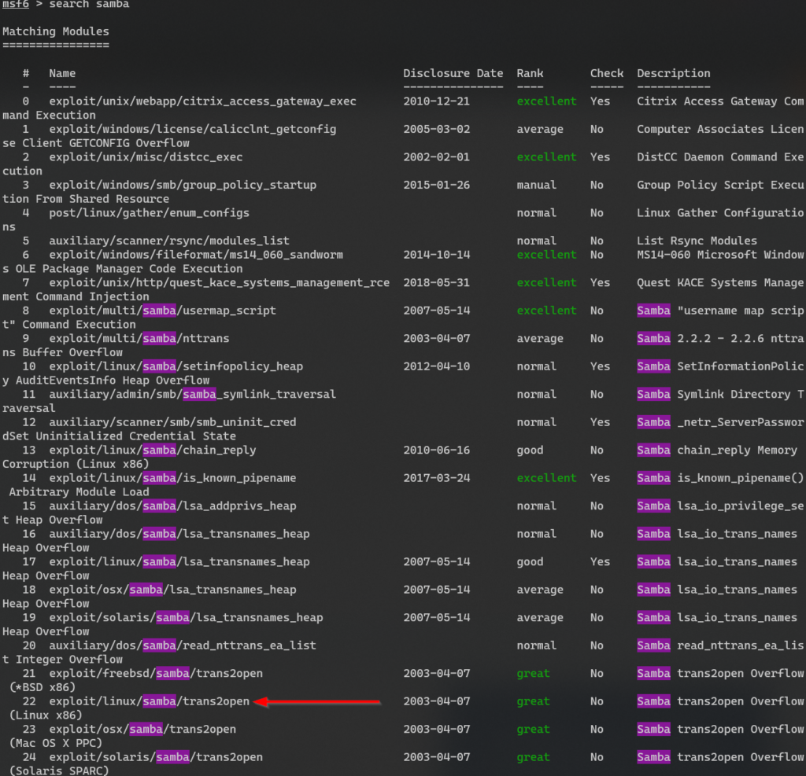

We are going to be using option `22`, the `exploit/linux/samba/trans2open`:

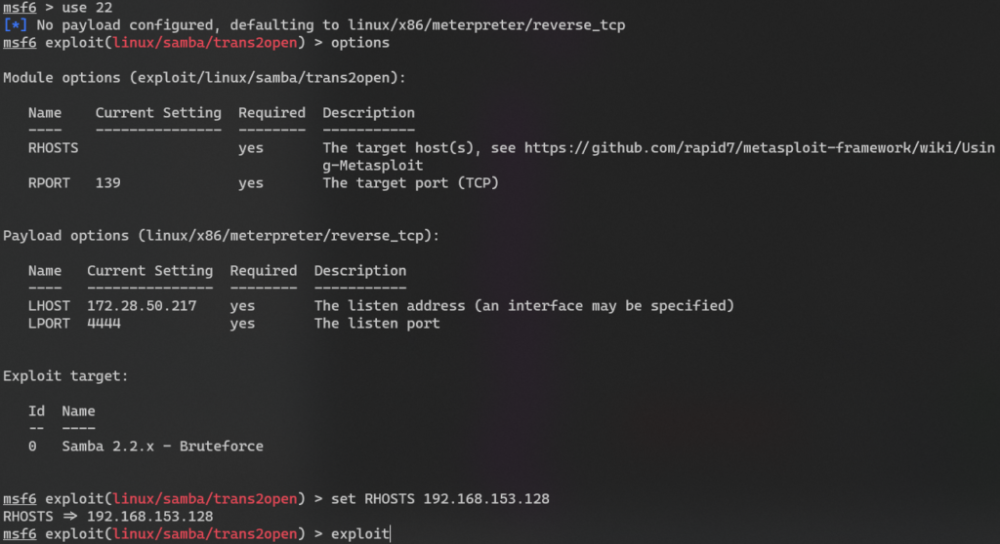

In my case, after we ty the exploit, we can see that we are close to getting a `Meterpreter` shell, but it keeps on dying....That's no fun. If we take a look at the source code, it looks like it is walking the stack and trying the different return addresses to attempt the buffer overflow exploit in the `reply_trans2()` function. In theory this should work...

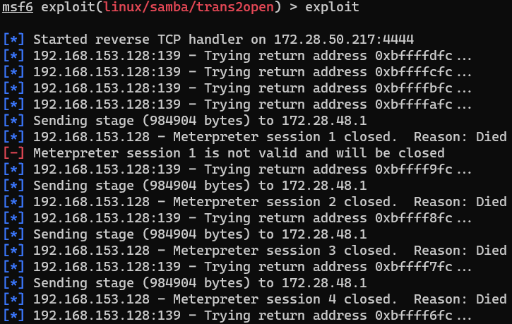

This is telling me that the exploit looks to be "kind of" working but there may be something wrong with the payload, which is the code that we want to run after the exploit. In a nutshell, the way this works is that we have an exploit which takes advantage of the vulnerability and gets us to the point where can run our own code, the payload would be "our own code" that we want to run after the exploit, which in this case is the `meterpreter` shell. Let's take a look at our options one more time:

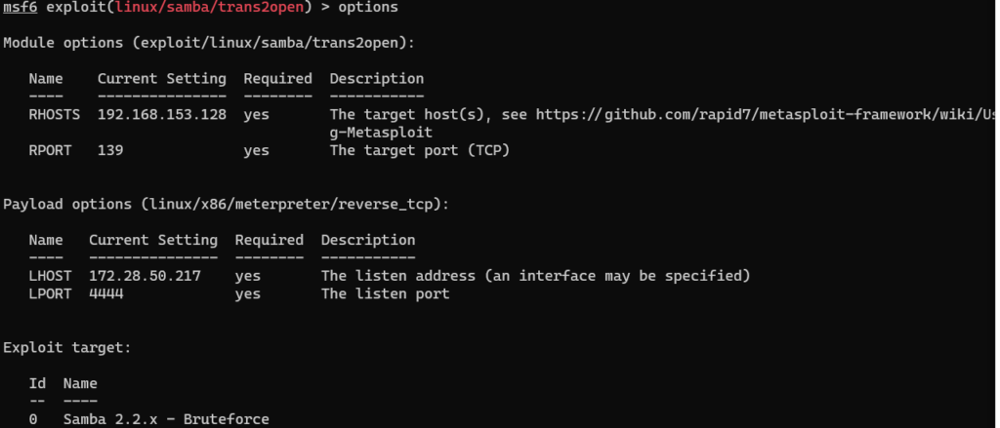

Right now, we are using a staged payload. Let's try a non-staged payload and see if that works for us?

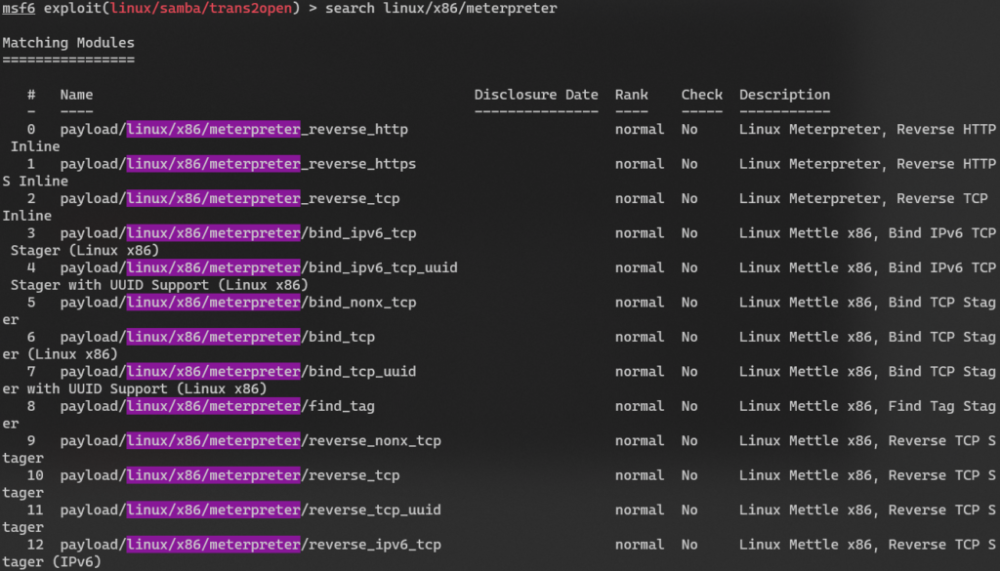

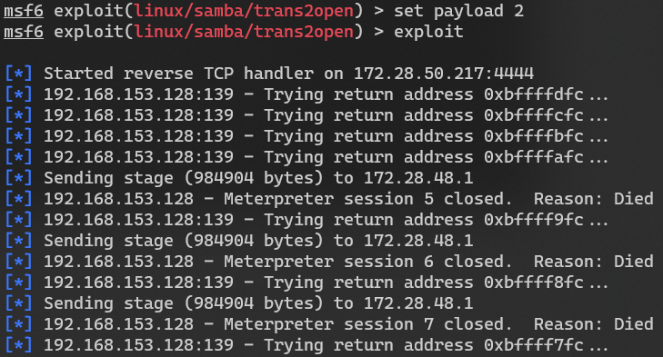

Hmm no luck, let's try a different payload altogether since `meterpreter` just doesn't seem to be working for us:

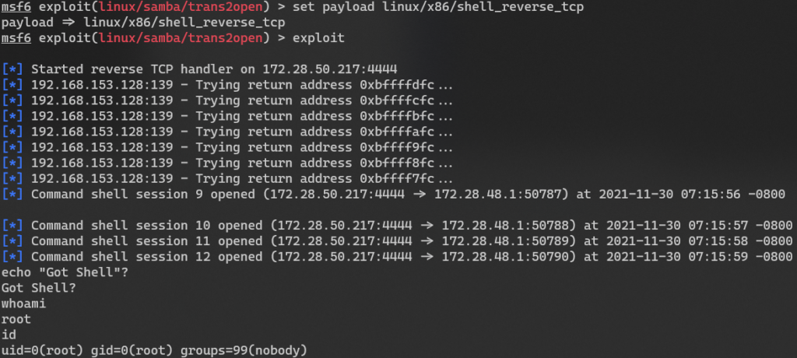

Money!! We got our self a `root` shell. Thus, we have successfully rooted the machine which was our main goal! As you can see, as hackers we must be resilient and not just give up when something doesn't work the first time. The motto of "Try Harder" really comes into play :)

# Post Exploitation + Maintaining Access

From here we could establish persistence by creating another user and/or setting up a backdoor to allow us for easier access next time in case the machine get patched. Real attackers may patch the machine and have their own backdoor setup to limit access to others who could exploit these vulnerabilities.

We can now also use this machine as our staging/jump host machine to install tooling and for further recon and pivoting into the rest of the network. Meaning that we can see what other machines are available to us from here which we may be able to access and possibly exploit to expand our capabilities and what information we have access to.

We should also look in this machine for other things that we can use such as SSH keys, interesting files, access to important data?

# Covering Tracks & Clean Up

If we installed any backdoors or other binaries, we should clean those up. Our goal should be to leave the systems we touched in an equal or better state than we found them in. You don't want to leave a backdoor open on a critical system that may get overlooked and then an attacker can leverage that to get a foothold on the network. We could also wipe the logs and history.

# The Report

Last but not least the report out! It is a very important part of the assessment. When we write the report is where we get to materialize all this and share with stakeholders at different levels of all our findings. Remember all of those notes of our hard work along the way and the screenshots we took? This is where we get to share this information and why it is very important to take good notes and screenshots along the way. I think a good approach is to write your notes in a way that they just fall into the report so you can copy and paste and only need to make some minor adjustments. Another good approach is to write the report or fill in parts as you go, that way they are fresh in your mind. In the end it would be nice to just have to spend time in the executive summary and tightening the other parts in rather than writing the whole report from scratch.
