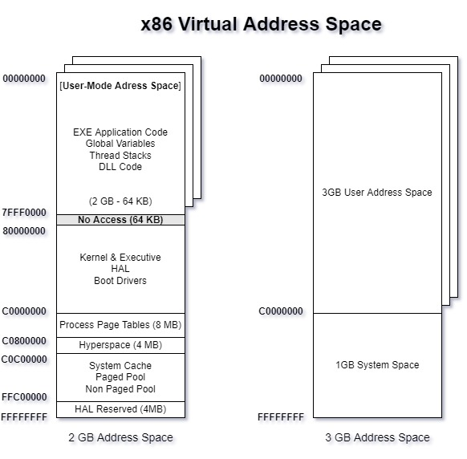
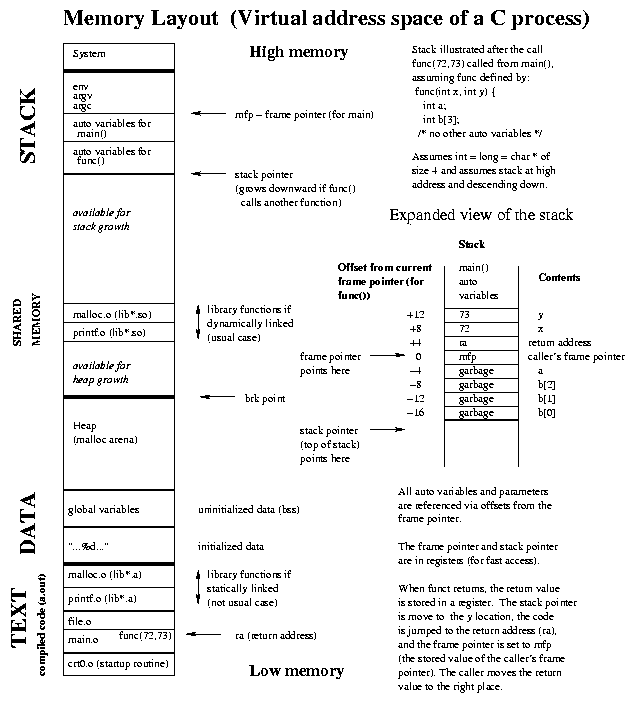
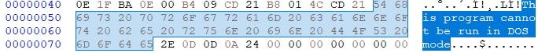
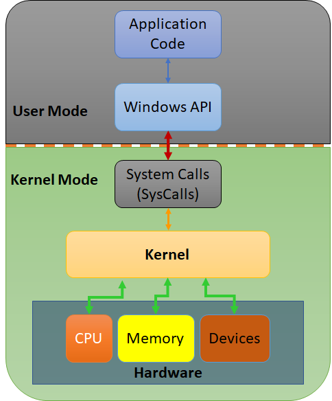

# Windows Internals

This is my second post on this series, for further reference checkout the first post: [HackingTheCode \[0x00\]](https://revx0r.com/hacking-the-code-0x00/)

> 💡 **DISCLAIMER:**  
> When I create these blog posts, not only am I trying to help folks but I am also creating a reference document for myself. Thus, some of the content might overlap and be redundant, but my goal is not to copy some content for the sake of doing so and claiming it as my own. The goal rather is so that anyone (including my self) is able to reference the posts and get the most out of it without having to invest additional time (sometimes a lot extra...) doing some of the following activities while learning the material within scope: jump around a lot of pages, looking at a lot of documentation, clarifying things, connecting the dots, and researching (which I do while writing most, if not all of my posts) among others.

**Pre-requisites** that I think will help you get the most out of this post:

- Operating System knowledge
- Program Layout
- Coding (especially C/C++)

# Processes

In a nutshell, we can think of a process as the running version of a program/binary, although an application can have more than one process and they are a bit more complicated than just the running program itself 😊.

Straight from the Microsoft Docs [About Processes and Threads](https://docs.microsoft.com/en-us/windows/win32/procthread/about-processes-and-threads):

> Each _process_ provides the resources needed to execute a program. A process has a virtual address space, executable code, open handles to system objects, a security context, a unique process identifier, environment variables, a priority class, minimum and maximum working set sizes, and at least one thread of execution. Each process is started with a single thread, often called the _primary thread_, but can create additional threads from any of its threads.

Processes can be used/abused by attackers in a variety of different ways and not limited to evading detections, privilege escalations and hiding in plain sight through existing Windows processes. Reference the below links to some of the [MITRE ATT&CK](https://attack.mitre.org/) documented TTPs:

- Process Injection ([TI055](https://attack.mitre.org/techniques/T1055/))
- Process Hollowing ([TI055.012](https://attack.mitre.org/techniques/T1055/012/))
- Process Masquerading ([TI055.013](https://attack.mitre.org/techniques/T1055/013/))

[High Level Critical Process Components](https://www.notion.so/63a50c9fc9094cd89cacbf00499500b4)

[Low Level Process Virtual Address Space](https://www.notion.so/cc7b9973842442c5a7b2c6e37f411c03)

Virtual Address Space Layout



Virtual Address Space of a C Process



Sourced from: [https://www.cs.uleth.ca/~holzmann/C/system/memorylayout.gif](https://www.cs.uleth.ca/~holzmann/C/system/memorylayout.gif)

## Threads

You can think of a thread as controlling how the process executes, spawned from the main process of an application, further from the docs:

> A _thread_ is the entity within a process that can be scheduled for execution. All threads of a process share its virtual address space and system resources. In addition, each thread maintains exception handlers, a scheduling priority, thread local storage, a unique thread identifier, and a set of structures the system will use to save the thread context until it is scheduled. The _thread context_ includes the thread's set of machine registers, the kernel stack, a thread environment block, and a user stack in the address space of the thread's process. Threads can also have their own security context, which can be used for impersonating clients.

Threads inherit PPID properties and resources, but also include their own:

[Thread Attributes](https://www.notion.so/ae972c8cea414093b5c99d66456e9a3a)

Threads can also be abused and leveraged by attackers to execute code because they are, after all used to control execution.

# Virtual Memory

From [Microsoft docs](https://docs.microsoft.com/en-us/windows/win32/memory/virtual-address-space):

> The virtual address space for a process is the set of virtual memory addresses that it can use. The address space for each process is private and cannot be accessed by other processes unless it is shared.

> A virtual address does not represent the actual physical location of an object in memory; instead, the system maintains a _page table_ for each process, which is an internal data structure used to translate virtual addresses into their corresponding physical addresses. Each time a thread references an address, the system translates the virtual address to a physical address.

The Memory Manager translates the virtual address to physical address. This functionality prevents issues where processes directly writing to physical memory have the potential to cause damage.

Additionally using Virtual Memory the operating system can map a virtual address to disk for temporary storage. This tends to mostly be used in the case where the system is running out of memory.

# Dynamic Link Libraries (DLLs)

DLLs are shared code available for applications to use and often provide the means for the application to interface with the operating system.

From [Microsoft Docs on Dynamic Link Library (DLL)](https://docs.microsoft.com/en-us/troubleshoot/windows-client/deployment/dynamic-link-library):

> A DLL is a library that contains code and data that can be used by more than one program at the same time. .

> For the Windows operating systems, much of the functionality of the operating system is provided by DLL.

> The use of DLLs helps promote modularization of code, code reuse, efficient memory usage, and reduced disk space. So, the operating system and the programs load faster, run faster, and take less disk space on the computer.

The good side about using DLLs is the code reuse part and that a lot of what we need to interface with the operating system is available to us. The not so great side is that when we are using DLLs, we are taking an external dependency on the DLLs and functions/code that the application might be counting on using, thus if any of the DLLs are missing then the application will not work properly (it is basically missing code to perform the intended actions).

I suppose the “bad” side of DLLs, is the way that an attacker can take advantage of their functionality to achieve their goals. Here are some common attacks from MITRE ATT&CK:

- DLL Hijacking ([T1574.001](https://attack.mitre.org/techniques/T1574/001/))
- DLL Side-Loading ([T1574.002](https://attack.mitre.org/techniques/T1574/002/))
- DLL Injection ([T1055.001](https://attack.mitre.org/techniques/T1055/001/))

## Code DLL Examples sourced from MSFT Docs

### DLL w/ (optional) Entry Point

```cpp
BOOL APIENTRY DllMain(
HANDLE hModule,// Handle to DLL module
DWORD ul_reason_for_call,// Reason for calling function
LPVOID lpReserved ) // Reserved
{
    switch ( ul_reason_for_call )
    {
        case DLL_PROCESS_ATTACHED: // A process is loading the DLL.
        break;
        case DLL_THREAD_ATTACHED: // A process is creating a new thread.
        break;
        case DLL_THREAD_DETACH: // A thread exits normally.
        break;
        case DLL_PROCESS_DETACH: // A process unloads the DLL.
        break;
    }
    return TRUE;
}
```

### DLL + App Calling it

**`SampleDLL.cpp`**

```cpp
// SampleDLL.cpp
//

#include "stdafx.h"
#define EXPORTING_DLL
#include "sampleDLL.h"
BOOL APIENTRY DllMain( HANDLE hModule, DWORD ul_reason_for_call, LPVOID lpReserved
)
{
    return TRUE;
}

void HelloWorld()
{
    MessageBox( NULL, TEXT("Hello World"), TEXT("In a DLL"), MB_OK);
}
```

**`SampleDLL.h`**

```cpp
// File: SampleDLL.h
//
#ifndef INDLL_H
    #define INDLL_H
    #ifdef EXPORTING_DLL
        extern __declspec(dllexport) void HelloWorld();
    #else
        extern __declspec(dllimport) void HelloWorld();
    #endif

#endif
```

**`SampleApp.cpp` calling the sampleDLL by including the header file \[Load-Time Dynamic Linking\]**

```cpp
// SampleApp.cpp
//
#include "stdafx.h"
#include "sampleDLL.h"
int APIENTRY WinMain(HINSTANCE hInstance, HINSTANCE hPrevInstance, LPSTR lpCmdLine, int nCmdShow)
{
    HelloWorld();
    return 0;
}
```

**App Code Snippet calling DLL via `LoadLibrary()` \[Run-Time Dynamic Linking\]:**

```cpp
...
typedef VOID (*DLLPROC) (LPTSTR);
...
HINSTANCE hinstDLL;
DLLPROC HelloWorld;
BOOL fFreeDLL;

hinstDLL = LoadLibrary("sampleDLL.dll"); //Load DLL
if (hinstDLL != NULL)
{
    HelloWorld = (DLLPROC) GetProcAddress(hinstDLL, "HelloWorld"); //Locate Function Call
    if (HelloWorld != NULL)
        (HelloWorld);
    fFreeDLL = FreeLibrary(hinstDLL);
}
...
```

A important piece of information is that Windows searches for DLLs in the following locations and in this explicit order:

1. The application folder
    
2. The current folder
    
3. The Windows system folder
    
    **Note:** The `GetSystemDirectory` function returns the path of the Windows system folder.
    
4. The Windows folder
    
    **Note:** The `GetWindowsDirectory` function returns the path of the Windows folder.
    

# Portable Executable File Format (PE)

A Portable Executable (PE) is what you would more commonly think of an executable application or program with a typical `.exe` extension. As with most computer related shenanigans, there is a structure that this executable programs have to follow to be loaded into memory into usable running code to do their job.

We can open any program in hex editor to see what it looks in hex view (think of this a bit like looking at the file through a microscope, sorta...).

# DOS Header

With Windows executables, they are identified pretty quickly by the magic number `4D 5A 90`, the first two are the well known `MZ` (if you are curious, the MZ are the initials of the great [Mark Zbikowski](https://en.wikipedia.org/wiki/Mark_Zbikowski)).

## DOS Stub

As we continue on we find the `DOS Stub` starting at offset `0000004E`, `This program cannot be run in DOS mode`. This is a tiny part at the start of the program that shares that it is meant to run in Windows and not in the good ol’ DOS CLI.



## PE Header

The start of the PE header is very evident in the dump by the `PE 0\ 0\` or `50 45 00 00`. However, you can think of it being split into 3 parts: PE Signature (32 bits), PE file header, and PE optional header.


[PE Signature:](https://docs.microsoft.com/en-us/windows/win32/api/winnt/ns-winnt-image_file_header)

```c
typedef struct _IMAGE_FILE_HEADER {
  WORD  Machine;
  WORD  NumberOfSections;
  DWORD TimeDateStamp;
  DWORD PointerToSymbolTable;
  DWORD NumberOfSymbols;
  WORD  SizeOfOptionalHeader;
  WORD  Characteristics;
} IMAGE_FILE_HEADER, *PIMAGE_FILE_HEADER;
```

[PE File Header](https://docs.microsoft.com/en-us/windows/win32/api/winnt/ns-winnt-image_optional_header64):

```c
typedef struct _IMAGE_OPTIONAL_HEADER64 {
  WORD                 Magic;
  BYTE                 MajorLinkerVersion;
  BYTE                 MinorLinkerVersion;
  DWORD                SizeOfCode;
  DWORD                SizeOfInitializedData;
  DWORD                SizeOfUninitializedData;
  DWORD                AddressOfEntryPoint;
  DWORD                BaseOfCode;
  ULONGLONG            ImageBase;
  DWORD                SectionAlignment;
  DWORD                FileAlignment;
  WORD                 MajorOperatingSystemVersion;
  WORD                 MinorOperatingSystemVersion;
  WORD                 MajorImageVersion;
  WORD                 MinorImageVersion;
  WORD                 MajorSubsystemVersion;
  WORD                 MinorSubsystemVersion;
  DWORD                Win32VersionValue;
  DWORD                SizeOfImage;
  DWORD                SizeOfHeaders;
  DWORD                CheckSum;
  WORD                 Subsystem;
  WORD                 DllCharacteristics;
  ULONGLONG            SizeOfStackReserve;
  ULONGLONG            SizeOfStackCommit;
  ULONGLONG            SizeOfHeapReserve;
  ULONGLONG            SizeOfHeapCommit;
  DWORD                LoaderFlags;
  DWORD                NumberOfRvaAndSizes;
  IMAGE_DATA_DIRECTORY DataDirectory[IMAGE_NUMBEROF_DIRECTORY_ENTRIES];
} IMAGE_OPTIONAL_HEADER64, *PIMAGE_OPTIONAL_HEADER64;
```

PE Optional Header:

```c
typedef struct _IMAGE_SECTION_HEADER {
  BYTE  Name[IMAGE_SIZEOF_SHORT_NAME];
  union {
    DWORD PhysicalAddress;
    DWORD VirtualSize;
  } Misc;
  DWORD VirtualAddress;
  DWORD SizeOfRawData;
  DWORD PointerToRawData;
  DWORD PointerToRelocations;
  DWORD PointerToLinenumbers;
  WORD  NumberOfRelocations;
  WORD  NumberOfLinenumbers;
  DWORD Characteristics;
} IMAGE_SECTION_HEADER, *PIMAGE_SECTION_HEADER;
```

PE File Format Reference:

- [https://docs.microsoft.com/en-us/windows/win32/debug/pe-](https://docs.microsoft.com/en-us/windows/win32/debug/pe-format)
- [https://en.wikipedia.org/wiki/Portable\_Executable](https://en.wikipedia.org/wiki/Portable_Executable)[format](https://docs.microsoft.com/en-us/windows/win32/debug/pe-format)
- [https://devblogs.microsoft.com/oldnewthing/20060130-00/?p=32483](https://devblogs.microsoft.com/oldnewthing/20060130-00/?p=32483)
- Practical Binary Analysis

## Interacting with Windows Internals

The most straight forward way to interacting with Windows and its internals is via the Windows API.

When we are running code, at some point it will make some function calls (more notable in our case, interacting with Windows internals) that attempt to talk with the physical hardware. However, their is some limitations and the application code can not directly interact with the kernel or hardware.

Because of this, we have to understand the idea of user mode vs kernel mode code along with access levels, which are provided by the processor.

Our code starts ins user mode and when it requires to interface with the hardware, via an API to SysCall, then the process will switch modes

When we make The Windows kernel controls the code/processes and provides an interface for the software to talk to the hardware.



* * *

# TOOLING

### `Dependency Walker`

Dependency Walker is a tool used to examine the dependency of binaries in Windows. You can take a look at what libraries are being imported in applications and others.

### `Procmon`

> _Process Monitor_  is an advanced monitoring tool for Windows that shows real-time file system, Registry and process/thread activity...

In a nutshell, you can use Sysinternals Process Monitor (`Procmon`) to find useful information about processes including Stack information, Process ID (PID), Parent Process ID (PPID) and other process related shenanigans. It also allows you to save the output to a file in .PML format which you can open and review later.

- **Filtering**
    
    - I find filtering very powerful and can help you get your work done quite a bit faster.
    - To find the PID among thousands of events, we can use the filter option that allows to create something that looks like a regular expression.
        - Example:
            - If we are looking for the Notepad Process, we can use the the filter: `Process Name is noptepad.exe then Includee`
                - Note that Procmon automatically creates the rest of the filtering to concentrate on the events related to the process you are currently interested in
- Gathering additional Information
    
    - If we are interested in something like the Parent Process ID (PPID), we can do a couple of things:
        - **Select Columns**: You can right click on the column titles and click `Select Columns...` and follow by selecting Parent PID, Thread ID, User Name, and any others that you might be interested in viewing at this time.
            - Now you will be able to see them right from the main screen
        - **Event Properties**: You can also from the top menu click Event → Properties (Ctrl + P) to access additional details about the current Event. This windows has 3 tabs:
            - **Event**: Contains further information like Parent PID, Thread ID, Command line, CWD, Environment, ....
            - **Process**: Contains additional information but not limited to Integrity, Auth ID, Modules, Size of an image/DLL and Users among others
            - **Stack**: You can look at the stack for that event
- Operations of interest include but are not limited to `Load Image`
    

### `HxD`

It is a free Windows Hex editor. You can use it to crack open just about any file and look at it in hex view.

### [`Detect It Easy (DiE)`](https://horsicq.github.io/)

### [`PE Bear`](https://hshrzd.wordpress.com/pe-bear/#:~:text=PE%2Dbear%20is%20a%20freeware,to%20handle%20malformed%20PE%20files.)

## REFERENCES:

- Windows Internals Part 1, Seventh Edition
- TryHackMe's Windows Internals Room
- Microsoft Docs
- https://en.wikipedia.org/wiki/Portable\_Executable

## Additional Resources

- https://docs.microsoft.com/en-us/archive/msdn-magazine/2002/february/inside-windows-win32-portable-executable-file-format-in-detail
- https://docs.microsoft.com/en-us/archive/msdn-magazine/2002/march/inside-windows-an-in-depth-look-into-the-win32-portable-executable-file-format-part-2
- https://scorpiosoftware.net/category/windows-internals/
