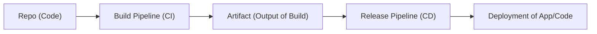

---
title: "DevOps Process tldr;"
parent: "Supply_Chain_Security"
layout: default
devops_mermaid_diagram: |

---   
  
# The DevOps CI/CD Process TLDR;
I find that sometimes folks find it confusing to visualize and understand the DevOps process and to understand the security around it. My intention for this write-up is to make what can be a complex topic to understand, into a simple quick read to help you understand the process.

### Diagram of Execution
This is a high level overview of how to visualize the process:

# 1. Repository (Code)
This is where the source code of your application resides. It could be hosted on Azure Repos, GitHub, or any other supported version control system.
- **Pull Request:** It is good practice to require pull requests to prevent code to directly be pushed to the main branch and be directly integrated into the product. This could prevent threat actors from poisoning the software with malicious code.
- **Code Review:** Code should be reviewed to check for good code practices, style, bugs and as I pointed above, possible malicious code.
- **Require 2+ Approval** It is also good practice to require multiple engineers to approve the code/pull request, as an additional check to make sure everyone is aligned that this code is to be integrated into the software.

# 2. Build Pipeline (CI)
The build pipeline is responsible for fetching the code from the repository, compiling it, running tests, and producing an artifact as part of the Continuous Integration (CI). It typically involves:
- **Source Code Retrieval:** The pipeline pulls the latest code from the repository.
- **Compilation/Build:** The code is compiled or built, depending on the language and framework.
- **Unit Testing:** Automated tests are run to ensure the code works as expected.
- **Artifact Creation:** The output of the build process, such as binaries, packages, or Docker images, is generated and stored.
- Note that at any time during this process a threat actor could poison the code or gain access to the resources used in the pipeline, thus we should use the principle of least privilege and tightened permissions & security around the pipeline(s). 

# 3. Artifact (Output of Build)
The artifact is the result of the build process. It is a packaged version of the application, ready for deployment. This could be in the form of compiled binaries, container images, or other deployable packages.
- If a threat actor gains access to this directly, they could replace the artifact with a poisoned/malicious artifact to run code downstream.

# 4. Release Pipeline (CD)
The release pipeline takes the artifacts produced by the build pipeline and manages the deployment process as part of Continuous Delivery/Deployment (CD). It typically involves:
- **Staging:** Deploying the artifact to a test environment for further testing (integration, performance, etc.).
- **Approval Gates:** Steps where manual approvals may be required before moving to the next stage.
- **Deployment:** Automated deployment to the production environment, or other environments, as defined in the pipeline.
- Note that at any time during this process Threat Actors could gain access to resources and poison the application's code by replacing it (similar to the CD step) and once again we should use the principle of least privilege and tightened permissions & security around the pipeline(s). 

# 5. Deployment of App/Code
The final product of this process involves deploying the application or code to the target environment, such as a web server, cloud infrastructure, or a set of virtual machines. While the deployment is often handled by the Release pipeline, there are a few things to highlight about this step of the process.

The deployment can include tasks like:
- **Configuration Management:** Applying configuration settings specific to the environment.
- **Database Migrations:** Applying database changes if necessary.
- **Verification:** Running smoke tests or other checks to ensure the deployment was successful.
