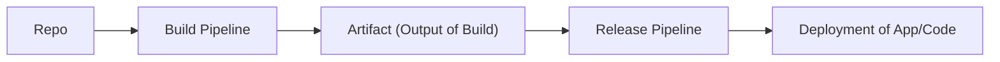

# 1. Repository (Repo)
This is where the source code of your application resides. It could be hosted on Azure Repos, GitHub, or any other supported version control system.

# 2. Build Pipeline
The build pipeline is responsible for fetching the code from the repository, compiling it, running tests, and producing an artifact. It typically involves:
- **Source Code Retrieval:** The pipeline pulls the latest code from the repository.
- **Compilation/Build:** The code is compiled or built, depending on the language and framework.
- **Unit Testing:** Automated tests are run to ensure the code works as expected.
- **Artifact Creation:** The output of the build process, such as binaries, packages, or Docker images, is generated and stored.

# 3. Artifact (Output of Build)
The artifact is the result of the build process. It is a packaged version of the application, ready for deployment. This could be in the form of compiled binaries, container images, or other deployable packages.

# 4. Release Pipeline
The release pipeline takes the artifacts produced by the build pipeline and manages the deployment process. It typically involves:
- **Staging:** Deploying the artifact to a test environment for further testing (integration, performance, etc.).
- **Approval Gates:** Steps where manual approvals may be required before moving to the next stage.
- **Deployment:** Automated deployment to the production environment, or other environments, as defined in the pipeline.

# 5. Deployment of App/Code
The final step involves deploying the application or code to the target environment, such as a web server, cloud infrastructure, or a set of virtual machines. The deployment can include tasks like:
- **Configuration Management:** Applying configuration settings specific to the environment.
- **Database Migrations:** Applying database changes if necessary.
- **Verification:** Running smoke tests or other checks to ensure the deployment was successful.
