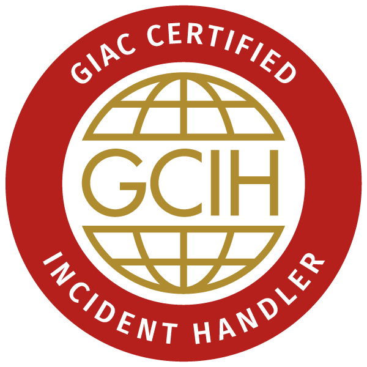
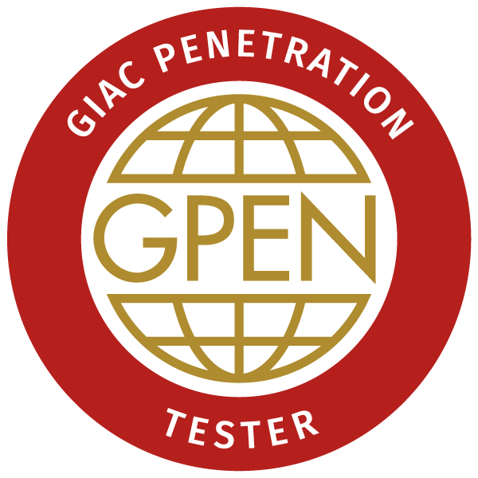

# `root@pwned / % whoami`
My name is Manny Berrueta ([@ManuelBerrueta](https://twitter.com/ManuelBerrueta)). I am a Offensive Security Engineer in a never-ending learning journey who has been playing with computers and electronics since I was very young, and continue to be very fascinated by these things! I have built my own machines over the years and taken plenty of things apart, sometimes just to see what makes them tick.

I started programming in `QBasic` with an old toaster, then moved up to Visual Basic and learned to do some silly things with AOL which I had the privilege to access with my very robust 56K US Robotics dial-up modem (miss the sounds sometimes...).

Fueled by a passion for security, with added sparks by the iconic "Hackers" movie, I delved deep into the art of uncovering and leveraging "unwanted features" in systems. My journey has been rich with exploration—from server management to the nuances of hex editing in games. It's a field where curiosity meets knowledge, and I'm always eager to share and learn more in this ever-evolving domain.

After a few life detours, including serving in the Marine Corps, I finished my Computer Science degree with a focus on Systems and Security.While pursuing my degree I also managed to hack myself into a scholarship to the SANS Institute's via their Cyber FastTrack program ([Cyber FastTrack Finalists](https://medium.com/cyber-fasttrack/scholarships-awarded-to-100-cyber-fasttrack-finalists-287b209630)) to earn 3 security certifications!

I continue to feed my curiosity with my work in offensive security where I get to do fun things & secure systems used daily by folks all around the world. My work so far has led me to do a diverse number of things including performing Red Team, Purple Team, Pentesting and AppSec operations (think of looking for "unwanted features" ;) ), attack surface analysis, vulnerability assessments, threat modeling, reverse engineering, exploit development, fuzzing, hardware testing, tool development and security software development to secure nodes at cloud scale and speed.

For fun I like to check out CTF's, security research, tinker with electronics, read books, make toys go faster, enjoying the great outdoors with my family like going off road with the ATVs, fishing, and boating.

I am very passionate about security and for me it's not just a job, but a mindset, and part of my life. I live and breathe it, and I take pride in that what I do helps improve the security of the products that people around the world use every day!

---    
### Hacking shenanigans

<figure>
<table>
<tbody>
<tr>
<td></td>
<td></td>
<td></td></tr></tbody></table>
</figure>

> You can check out my badges @ [https://www.credly.com/users/manuel-berrueta/badges](https://www.credly.com/users/manuel-berrueta/badges)

---   
### Some of my favorite quotes
> “_Never memorize something that you can look up_.”  
> ― Albert Einstein

> _“_Everything should be made as simple as possible, but no simpler_.”_  
> ― Albert Einstein
